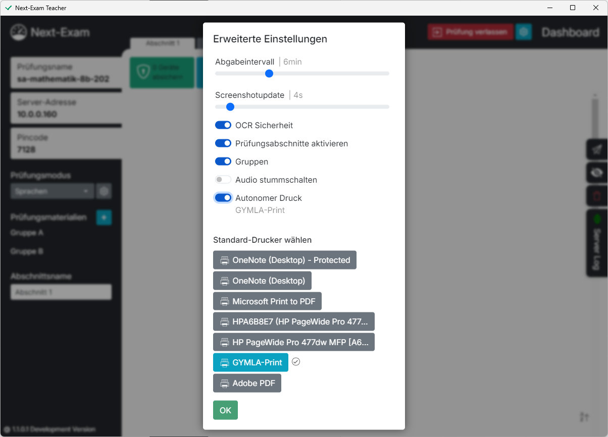
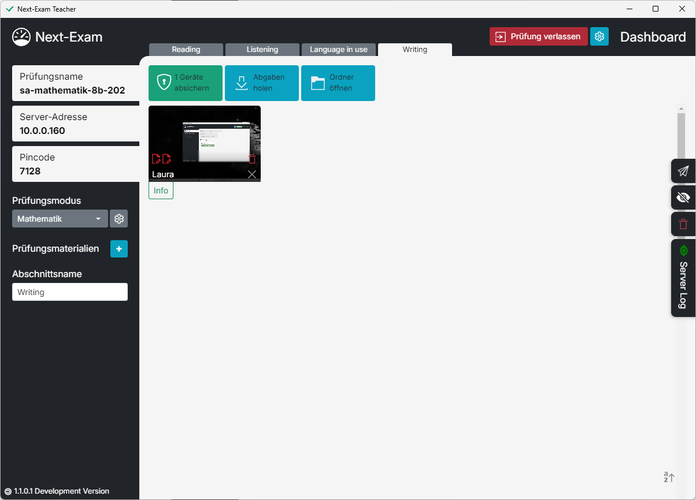
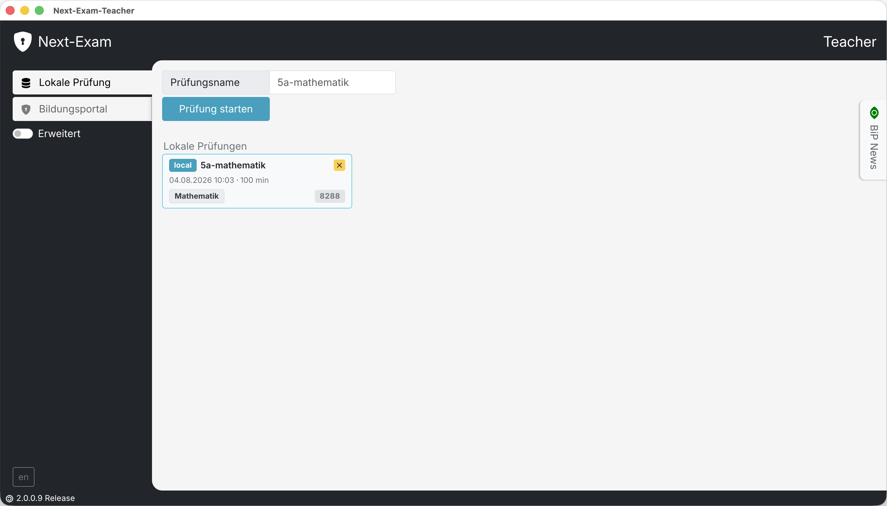

# Erweiterte Funktionen

Die erweiterten Prüfungseinstellungen sind im Dashboard über das **Zahnrad-Symbol** (oben rechts) erreichbar. Änderungen an den Abschnitts- und Moduseinstellungen sind nur möglich, solange die Prüfung noch nicht abgesichert wurde.

<!-- SCREENSHOT: advanced_settings -->
<figure markdown="span">
    {width="60%"}
    <figcaption>Erweiterte Einstellungen (Zahnrad-Symbol)</figcaption>
</figure>

---

## Prüfungsabschnitte

Für Prüfungen mit getrennten Teilen (z. B. Sprachschularbeit mit Hörverständnis und Textproduktion) können **Prüfungsabschnitte** aktiviert werden:

- **Prüfungsabschnitte aktivieren** und pro Abschnitt einen **Abschnittsnamen** vergeben.
- Jeder Abschnitt hat einen eigenen Prüfungsmodus, eigene Materialien und **Abschnittseinstellungen** (Gruppen, Zeitlimits usw.).
- **Wechsel der Abschnitte:** Standardmäßig schaltet die Lehrkraft die Abschnitte frei („Abschnitt durch Lehrer“). Mit **Abschnittswechsel erlauben** dürfen die Schüler:innen selbst zum nächsten Abschnitt wechseln („Abschnitt durch Schüler“).
- Nicht vollständig konfigurierte Abschnitte verhindern das Absichern der Geräte; im laufenden Prüfungsmodus können Abschnitte nicht deaktiviert werden.

## Zeitlimit

- **Prüfungsdauer:** Zeitlimit in Minuten für die gesamte Prüfung.
- **Abschnittsdauer:** Bei aktivierten Abschnitten kann je Abschnitt ein eigenes Zeitlimit festgelegt werden.
- Nach Ablauf erscheint der Hinweis „Zeitlimit abgelaufen“ mit dem betroffenen Abschnitt.

## Gruppen A/B

- **Gruppen** aktivieren, um die Klasse in zwei Gruppen zu teilen.
- Die Zuweisung erfolgt am Student-Widget (**A**/**B**, **Gruppe wechseln**); die Schüler:innen sehen ihre Gruppe im Kopfbereich der Student-App.
- Prüfungsmaterialien, Test-URLs, Templates und Modus-Einstellungen können getrennt für Gruppe A und B definiert werden.

## Erweiterte Sicherheitsfunktionen

- **Screenshot Update:** Intervall in Sekunden, in dem die Screenshots der Schüler:innen-Geräte aktualisiert werden (0 = deaktiviert).
- **Automatische Sicherung (Backup-Intervall):** Intervall in Minuten, in dem die Arbeiten automatisch geholt werden.
- **Autonomer Druck:** Erlaubt den Schüler:innen, Druckaufträge direkt zu starten; dazu wird ein **Standard-Drucker** am Teacher-Gerät gewählt. Ohne diese Freigabe erzeugt jede Druckanfrage eine Rückfrage bei der Lehrkraft.
- **Warntöne deaktivieren:** Schaltet akustische Signale während der Prüfung aus.

## Virtualisierungserkennung

Next-Exam erkennt, wenn die Prüfungsumgebung vermutlich in einer **virtuellen Maschine** läuft, und markiert das betroffene Widget („virtualisierte Arbeitsumgebung“). Die Detailansicht zeigt die Befunde (Backend-Erkennung, WebGL-Erkennung, Vendor). Ebenso wird gewarnt, wenn am Schüler:innen-Gerät möglicherweise **Remote-Assistant-Software** aktiv ist.

## Prüfungsprotokoll (Event Log)

Über **Event Log öffnen** wird das detaillierte Prüfungsprotokoll angezeigt:

- Ereignisse wie Serverstart/-stopp, Prüfungsstart/-ende, Anmeldungen, Re-Logins, Offline-Phasen, Fokus-Verluste, Virtualisierung, Abgaben, Druckanfragen und Entfernen aus der Prüfung.
- Beim Prüfungsstart werden die aktiven **Prüfungseinstellungen** (Modus, Materialien, Gruppen, LanguageTool …) mitprotokolliert.
- Das Protokoll kann gedruckt und damit archiviert werden.

## Abgabenübersicht

**Abgabenübersicht** zeigt alle eingegangenen Abgaben tabellarisch (Schüler:in, Datei, Abschnitt, Datum) – praktisch als Abgabe-Checkliste vor dem Beenden der Prüfung.

## Verschlüsselte PDFs öffnen

Auf den Schüler:innen-Geräten erstellte PDFs werden verschlüsselt (NXE1) abgelegt. Über **PDF entschlüsseln** kann die Lehrkraft eine solche Datei öffnen; das Verschlüsselungs-Geheimnis stammt aus der Prüfungskonfiguration des Servers.

## Signierte PDFs validieren

Abgaben werden automatisch signiert. Über die Validierungsfunktion (**Signiertes PDF**) prüft die Lehrkraft:

- **Integrität:** Ist das PDF seit der Abgabe unverändert? („Signatur intakt“ / „Signatur ungültig oder PDF wurde verändert“)
- **Aussteller-Verifikation:** Bei BiP-signierten Abgaben kann die Identität des Ausstellers über eine Bildungsportal-Anmeldung bestätigt werden. Lokal signierte Abgaben belegen nur die Unverändertheit, nicht die Identität.

## Sprache der Benutzeroberfläche

Die Sprache der Teacher-Oberfläche (u. a. Deutsch, Englisch) wird über das Sprachmenü umgestellt.

## Bildschirm abdunkeln

<!-- SCREENSHOT: advanced_dashboard_exam -->
<figure markdown="span">
    {width="60%"}
    <figcaption>Erweiterte Funktionen am Dashboard nach Prüfungsstart</figcaption>
</figure>

Mit **Bildschirme sperren** dunkelt die Lehrkraft die Bildschirme aller Schüler:innen ab – etwa für Ansagen oder Pausen. **Bildschirme freigeben** hebt die Sperre wieder auf.

## Lokal gesicherte Prüfungen löschen bzw. fortsetzen

<!-- SCREENSHOT: advanced_dashboard -->
<figure markdown="span">
    {width="60%"}
    <figcaption>Lokale Prüfungen auf der Startseite</figcaption>
</figure>

Next-Exam sichert jede Prüfung im Arbeitsordner **EXAM-TEACHER** (Schülerarbeiten, Abgaben, Konfiguration). Auf der Startseite kann eine Prüfung per Klick auf den Namen **fortgesetzt** oder über das `x`-Symbol **gelöscht** werden.
