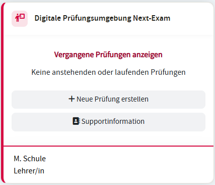
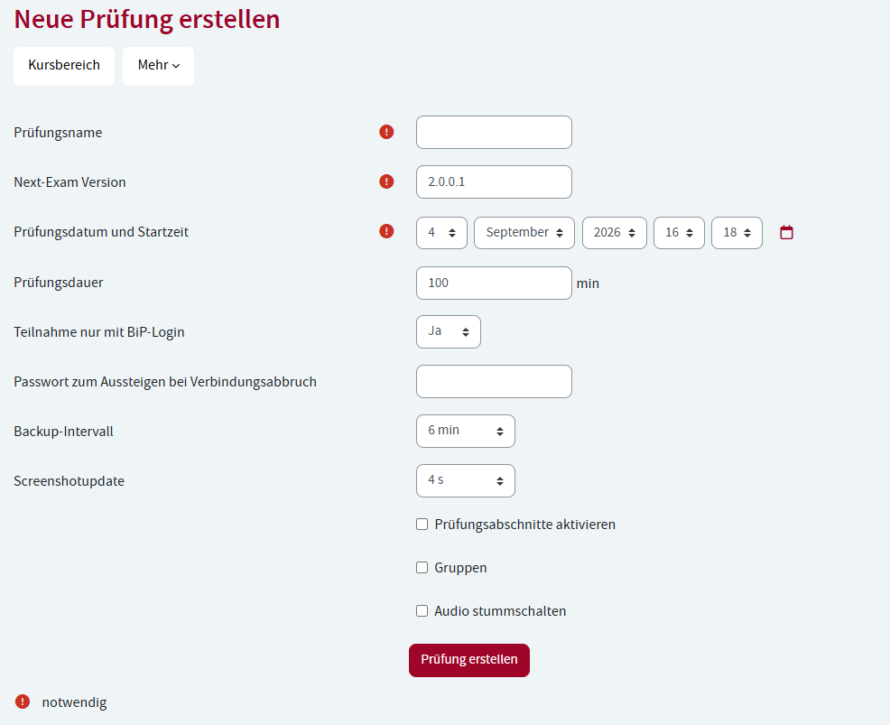
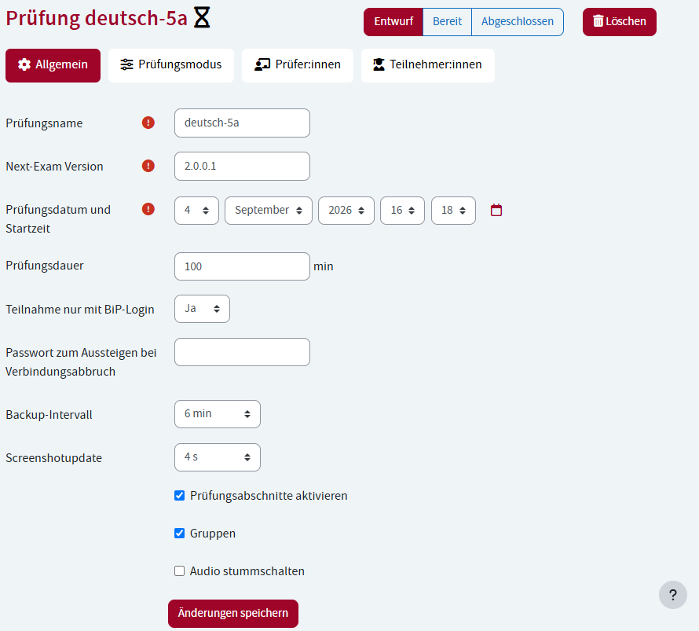

# Bildungsportal (BiP) - Anleitung für Lehrpersonen

Das österreichische **Bildungsportal** ist ein zweiter, alternativer Weg, eine Prüfung zu konfigurieren – zusätzlich zur lokalen Konfiguration direkt in der Teacher-App. Die Prüfung läuft dabei **nicht im Bildungsportal selbst**; das Portal liefert lediglich die Konfiguration (Prüfungsmodus, Materialien, Gruppen, Zuordnung der Schüler:innen), Next-Exam führt die Prüfung wie gewohnt lokal aus.

- Im Bildungsportal stehen dieselben Konfigurationsmöglichkeiten wie im Teacher-Dashboard zur Verfügung (z. B. Prüfungsmodus, Materialien, Gruppen).
- Prüfungen können im Vorfeld vollständig vorbereitet werden, inklusive **Zuordnung der teilnehmenden Schüler:innen**.
- Jeder Prüfungsmodus (Mathematik, Sprachen, Online-Modi, Active Sheets, RDP, Lokale VM) kann über das Bildungsportal konfiguriert werden – die BiP-Anmeldung ist also kein eigener Prüfungsmodus, sondern ein alternativer Konfigurationsweg.

Diese Anleitung erklärt Schritt für Schritt, wie im BiP eine Prüfung anlegegt, konfiguriert und verwaltet werden kann.

---

## 1. Überblick auf dem Dashboard

Auf Ihrem Dashboard finden Sie den Block **„Digitale Prüfungsumgebung Next-Exam“**. Dort sehen Sie:
<!-- SCREENSHOT: bip_teacher -->
<figure markdown="span">
    {width="100%"}
    <figcaption>Widget am BiP-Dashboard</figcaption>
</figure>
- **Nächste oder laufende Prüfungen** – alle Prüfungen, die Sie selbst erstellt haben oder bei denen Sie als Prüfer:in (Aufsicht) eingetragen sind.
- **Vergangene Prüfungen** – bereits abgehaltene Prüfungen (können ein-/ausgeblendet werden).
- Zu jeder Prüfung sehen Sie Name, Datum sowie den aktuellen **Status** (siehe Abschnitt 5).
- Über den Button **„Prüfung erstellen“** legen Sie eine neue Prüfung an.
- Über **„Supportinformation“** gelangen Sie zum Notfallplan Ihrer Schule (siehe Abschnitt 8).

!!! warning "Lehrpersonen mit absolviertem Qualifizierungsseminar"
     Falls an Ihrer Schule noch nicht genügend Lehrpersonen die vorgeschriebene Next-Exam-Schulung absolviert haben, wird im Block ein Warnhinweis angezeigt.

---

## 2. Eine neue Prüfung erstellen

1. Klicken Sie im Dashboard-Block auf **„Prüfung erstellen“**.
2. Füllen Sie das Formular aus:

<figure markdown="span">
    {width="50%"}
    <figcaption>Eine Prüfung anlegen</figcaption>
</figure>

| Feld | Erklärung |
|---|---|
| **Prüfungsname** | Pflichtfeld – Name der Prüfung |
| **Next-Exam Version** | Version der verwendeten Next-Exam-Software (Standard: 2.0.0.1) |
| **Prüfungsdatum und Startzeit** | Wann die Prüfung beginnt |
| **Prüfungsdauer** | Dauer in Minuten (Standard: 100) |
| **Teilnahme nur mit BiP-Login** | Legt fest, ob sich Teilnehmer:innen nur mit BiP-Zugang anmelden dürfen |
| **Passwort zum Aussteigen bei Verbindungsabbruch** | Optionales Passwort, mit dem Teilnehmer:innen die Prüfung bei Verbindungsabbruch vorzeitig verlassen können |
| **Backup-Intervall** | Wie oft automatisch ein Backup der Arbeit erstellt wird (in Minuten, 0 = aus) |
| **Screenshotupdate** | Wie oft ein Bildschirm-Screenshot zur Kontrolle übertragen wird (in Sekunden, 0 = aus) |
| **Prüfungsabschnitte aktivieren** | Erlaubt bis zu 4 unterschiedliche Abschnitte innerhalb einer Prüfung (z. B. verschiedene Aufgabenteile) |
| **Gruppen aktivieren** | Erlaubt es, Teilnehmer:innen in zwei Gruppen (A/B) mit unterschiedlichen Einstellungen/Aufgaben aufzuteilen |
| **Audio stummschalten** | Schaltet die Audioausgabe der Teilnehmer:innen-Geräte stumm |

3. Klicken Sie auf **„Prüfung erstellen“**. Sie werden automatisch zur Bearbeitungsseite der neuen Prüfung weitergeleitet und dabei selbst als Prüfer:in eingetragen.

---

## 3. Eine Prüfung bearbeiten

Öffnen Sie eine Prüfung über den Bearbeiten-Link im Dashboard-Block. Die Bearbeitungsseite ist in vier Reiter unterteilt:
<figure markdown="span">
    {width="50%"}
    <figcaption>Eine Prüfung editieren</figcaption>
</figure>

### 3.1 Reiter „Allgemein“
Hier können Sie die Grunddaten (siehe Tabelle oben) nachträglich ändern und speichern.

!!! info "Prüfung abgeschlossen"
    Sobald eine Prüfung auf **„Abgeschlossen“** gesetzt wurde, können keine Einstellungen mehr verändert werden.

### 3.2 Reiter „Prüfungsmodus“
Hier legen Sie fest, **wie** die Prüfung inhaltlich abläuft.

- Haben Sie *Prüfungsabschnitte* aktiviert, wählen Sie zunächst oben den gewünschten Abschnitt (1–4) aus und geben ihm optional eine **Bezeichnung**.
- Wählen Sie den **Prüfungsmodus**:

| Modus | Anwendung |
|---|---|
| **Mathematik** | Prüfungen mit mathematischem Editor |
| **Sprachen** | Texteditor mit Rechtschreibhilfe, Korrekturrand für PDF-Export usw. |
| **Eduvidual / Moodle** | Verlinkung zu einer Eduvidual/Moodle-Seite, optional per Safe-Exam-Browser-Konfiguration |
| **Google/Microsoft Forms** | Prüfung über ein externes Formular |
| **Webseite** | Freigabe einer bestimmten Webseite während der Prüfung |
| **Active Sheets** | Prüfung auf Basis einer PDF-Vorlage |
| **Microsoft365** | Prüfung mit Microsoft-365-Anwendungen |

- Je nach gewähltem Modus erscheinen zusätzliche Einstellungsfelder, zum Beispiel:
  - **Sprachen**: Schriftart/-größe, Zeilenabstand, Korrekturrand-Position im PDF, Rechtschreibhilfe (ein-/ausschalten, Sprache, Vorschläge), Vorlagendatei hochladen, Audio-Wiedergabe beschränken.
  - **Eduvidual/Moodle**: entweder eine **URL** angeben oder eine **Safe-Exam-Browser-Konfigurationsdatei** (inkl. Browser Exam Key und Passwort) hochladen.
  - **Webseite**: Ziel-URL sowie optional das Blockieren von Subdomains bzw. anderen Pfaden.
  - **Active Sheets**: PDF-Vorlagendatei hochladen.
- Ist „Gruppen aktivieren“ in der Prüfung eingeschaltet, können Sie zusätzlich die Option **„Konfiguration pro Gruppe“** wählen, um Gruppe A und Gruppe B unterschiedlich zu konfigurieren (z. B. unterschiedliche Aufgaben).

**Material hinzufügen:** Im unteren Bereich können Sie beliebig viele zusätzliche Materialien für den Abschnitt hochladen – entweder als **Datei** oder als **URL** (mit optionaler Sperre von Subdomains/anderen Pfaden). Bei aktivierten Gruppen legen Sie zusätzlich fest, welcher Gruppe das Material zugeordnet ist.

### 3.3 Reiter „Prüfer:innen“
- **Ansicht:** zeigt alle aktuell zugewiesenen Prüfer:innen (Aufsichten). Sie können hier Personen auswählen und über den Button entfernen.
- **Hinzufügen:** über den zweiten Unterreiter wählen Sie weitere Personen aus einer Liste aus und fügen sie als Prüfer:in hinzu.

### 3.4 Reiter „Teilnehmer:innen“
- **Ansicht:** zeigt alle aktuell zugewiesenen Teilnehmer:innen.
  - Sie können Teilnehmer:innen auswählen und **entfernen**.
  - Ist die Gruppenfunktion aktiv, können Sie ausgewählte Teilnehmer:innen stattdessen einer **anderen Gruppe (A/B)** zuweisen, statt sie zu entfernen.
- **Hinzufügen:** wählen Sie weitere Teilnehmer:innen aus der Liste aus. Bei aktivierten Gruppen legen Sie dabei fest, welcher Gruppe die neuen Teilnehmer:innen zugeteilt werden.

!!! info "Gruppenzuteilung"
    Wenn Sie die Gruppenfunktion nachträglich aktivieren, während bereits Teilnehmer:innen zugewiesen sind, werden diese automatisch der Gruppe A zugeteilt. Sie erhalten dazu einen Hinweis, damit Sie einen Teil der Klasse manuell in Gruppe B umverteilen können.

---

## 4. Prüfungsphase ändern

Oben auf der Bearbeitungsseite finden Sie drei Buttons, mit denen Sie die **Phase** der Prüfung wechseln:

| Phase | Bedeutung |
|---|---|
| **Entwurf** | Die Prüfung ist für Teilnehmer:innen noch nicht sichtbar. Nutzen Sie diese Phase, solange Sie die Prüfung noch vorbereiten. |
| **Bereit** | Die Prüfung ist für Teilnehmer:innen sichtbar. Das Betreten ist aber erst möglich, sobald die Prüfung in der Next-Exam-App tatsächlich geöffnet wird. |
| **Abgeschlossen** | Die Prüfung ist beendet. Es können keine Einstellungen mehr geändert werden. |

Klicken Sie einfach auf die gewünschte Phase, um zu wechseln.

---

## 5. Statusanzeige im Dashboard

Im Dashboard-Block wird jede Prüfung mit einem farbigen Symbol und der aktuellen Phase angezeigt (Entwurf / Bereit / Abgeschlossen), sodass Sie auf einen Blick sehen, in welchem Zustand sich Ihre Prüfungen befinden.

---

## 6. Eine Prüfung löschen

1. Öffnen Sie die Prüfung oder klicken Sie direkt im Dashboard-Block auf das Löschen-Symbol bei der jeweiligen Prüfung.
2. Bestätigen Sie die Sicherheitsabfrage **„Wollen Sie die Prüfung wirklich löschen?“**.

!!! warning "Daten"
    Das Löschen entfernt unwiderruflich alle Daten der Prüfung (Teilnehmer:innen, Prüfer:innen, Abschnitte, Einstellungen).
    > 🔒 Eine bereits **abgeschlossene** Prüfung kann nicht mehr gelöscht werden.

---

## 7. Berechtigungen

Für die oben beschriebenen Funktionen benötigen Sie das Recht **„Prüfungen bearbeiten“**. Ohne dieses Recht können Sie höchstens Prüfungen ansehen, aber nicht anlegen, ändern oder löschen. Falls Ihnen Funktionen fehlen, wenden Sie sich an die Administration Ihrer Schule bzw. Organisation.

---

## 8. Supportinformationen (Notfallplan)

Über den Link **„Supportinformation“** im Dashboard-Block gelangen Sie zu den hinterlegten **Notfallinformationen und Kontaktpersonen** Ihrer Organisation für den Fall von technischen Problemen während einer Prüfung. Nur berechtigte Personen können diese Informationen bearbeiten – alle anderen sehen die Seite in einer schreibgeschützten Ansicht.

---

## 9. Kurzübersicht / Checkliste für eine neue Prüfung

1. ☐ Prüfung im Dashboard erstellen (Name, Datum, Dauer, Grundeinstellungen)
2. ☐ Prüfungsmodus je Abschnitt festlegen und konfigurieren
3. ☐ Ggf. Gruppen aktivieren und getrennt konfigurieren
4. ☐ Zusätzliches Material hochladen (falls nötig)
5. ☐ Prüfer:innen (Aufsichten) hinzufügen
6. ☐ Teilnehmer:innen hinzufügen (ggf. mit Gruppenzuweisung)
7. ☐ Phase auf **„Bereit“** setzen, sobald alles vorbereitet ist
8. ☐ Nach der Prüfung Phase auf **„Abgeschlossen“** setzen

---

*Bei technischen Problemen während einer laufenden Prüfung nutzen Sie bitte die Kontaktpersonen bzw. den Notfallplan unter „Supportinformation“.*
