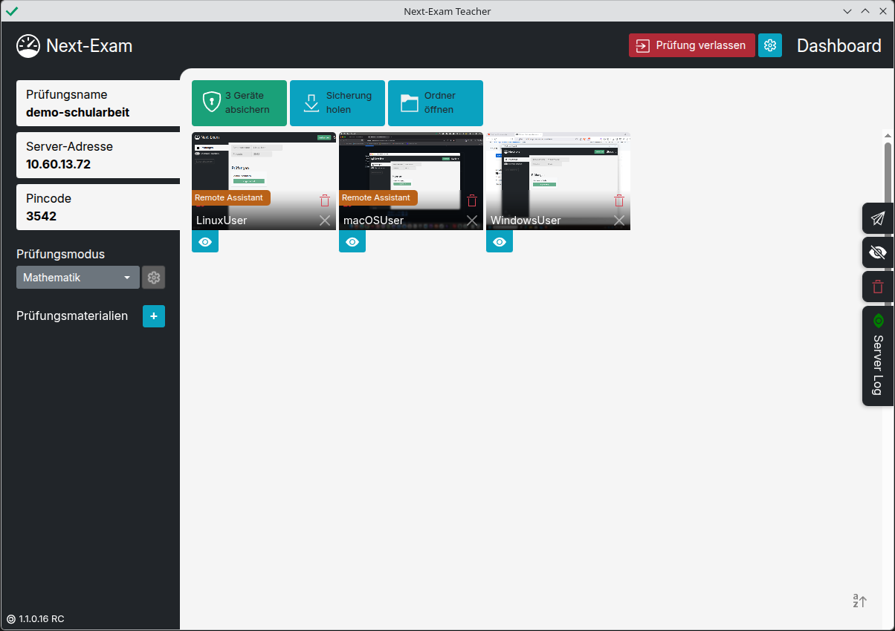

# Willkommen im Next-Exam-Handbuch

Download der Software unter [next-exam.at](https://www.next-exam.at).
Das Handbuch basiert auf der Next-Exam-Version 1.1.0.1

## Sicher prüfen leicht gemacht

- `Mathematik` - ... mit GeoGebra-Integration
- `Sprachen` - Texteditor mit erweiterten Features
- `Eduvidual/Moodle` - LMS-Test im Kiosk-Mode
- `Google Forms` - Formular im Kiosk-Mode
- `Microsoft 365` - online-Versionen von Word, Excel usw.
- `Website` - Website im Kiosk-Mode
- `RDP` - RD Web Client

<figure markdown="span">
    {width="800"}
    <figcaption>Next-Exam Teacher</figcaption>
</figure>

