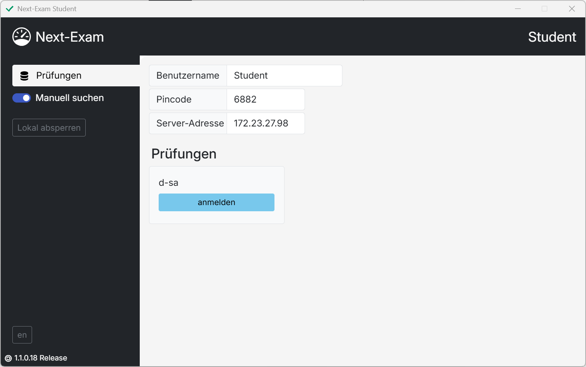

# Willkommen im Next-Exam-Handbuch

Dieses Handbuch unterstützt Lehrkräfte und Administrator*innen bei der Einrichtung und Verwendung der **Next-Exam Prüfungsumgebung**.  
Es basiert auf der Next-Exam-Version **1.1.0**.

> **Download:** Die aktuelle Version von Next-Exam steht unter  
> **https://www.next-exam.at**  
> zum Herunterladen bereit.

---

## Sicher prüfen – leicht gemacht

Next-Exam bietet eine sichere und flexible Umgebung für digitale Prüfungen in verschiedenen Szenarien:

- **Mathematik**  
  Prüfungen mit integrierter **GeoGebra-Umgebung**.

- **Sprachen**  
  Texteditor mit erweiterten Eingabe- und Formatierungsfunktionen.

- **Eduvidual / Moodle**  
  Sichere Lernmanagment-Tests im **Kiosk-Modus**.

- **Google Forms**  
  Durchführung von Formularprüfungen im **Kiosk-Modus**.

- **Microsoft 365**  
  Web-Versionen von Word, Excel und weiteren Tools, abgesichert gegen das Verlassen der Prüfungsoberfläche.

- **Webseiten**  
  Beliebige Webinhalte im eingeschränkten Kiosk-Modus.

- **RDP**  
  Zugriff auf Remote-Desktops über den **RD Web Client**.

---

Next-Exam besteht aus zwei Anwendungen - Teacher und Student.

## Next-Exam Teacher

Der „Teacher“-Bereich bietet eine übersichtliche Steuerungsoberfläche für die Verwaltung von Prüfungen, die Zuordnung von Geräten und die Live-Überwachung der Session.

<figure markdown="span">
    {width="50%"}
    <figcaption>Übersicht: Next-Exam Teacher</figcaption>
</figure>

## Next-Exam Student

Der "Student"-Bereich dient den Lernenden zum Einstieg in die Prüfung. Name, Pincode und ev. die Server-Adresse sind anzugeben.

<figure markdown="span">
    {width="50%"}
    <figcaption>Übersicht: Next-Exam Student</figcaption>
</figure>