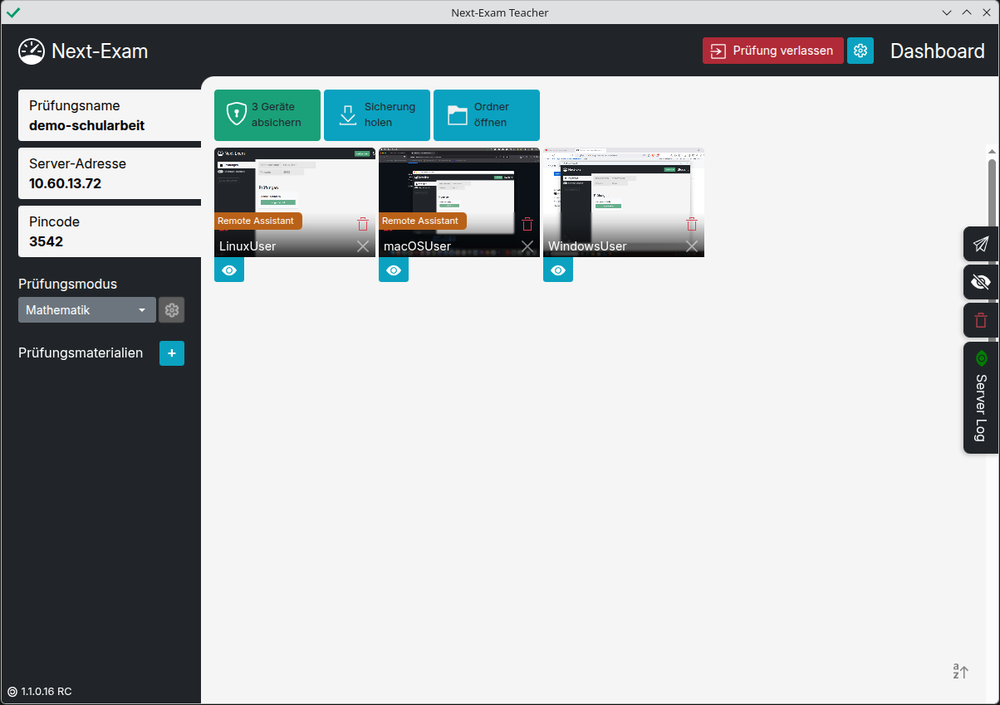

# Willkommen im Next-Exam Handbuch

Dieses Handbuch unterstützt Lehrkräfte und Administrator:innen bei der Einrichtung und Verwendung der **Next-Exam Prüfungsumgebung**.
Es basiert auf **Next-Exam Version 2.0.0**.

> **Download:** Die aktuelle Version von Next-Exam steht unter
> **<https://www.next-exam.at>**
> zum Herunterladen bereit.

---

## Sicher prüfen – leicht gemacht

Next-Exam bietet eine sichere und flexible Umgebung für digitale Prüfungen in verschiedenen Szenarien:

- **[Mathematik](modes/mathematik.md)**
  Prüfungen mit integrierter **GeoGebra-Umgebung** (Suite und Classic).

- **[Sprachen](modes/sprachen.md)**
  Texteditor mit Formatierungsfunktionen, LanguageTool-Rechtschreibhilfe, Audiodateien und Korrekturrand.

- **[Online-Modi](modes/online.md)**
  Eduvidual/Moodle, Google Forms, Microsoft Forms, Microsoft 365 und beliebige Websites – abgesichert gegen das Verlassen der Prüfungsoberfläche.

- **[RDP](modes/rdp.md)**
  Zugriff auf Remote-Desktops über den **RD Web Client**.

- **[Lokale VM](modes/localvm.md)**
  Prüfungen in einer lokalen virtuellen Maschine (QEMU) am Schüler:innen-Gerät.

- **[Active Sheets](modes/activesheets.md)**
  PDF-Arbeitsblätter mit interaktiven Formularfeldern – direkt ausfüllbar, inklusive Korrekturwerkzeugen für die Lehrkraft.

Zusätzlich kann jede Prüfung statt lokal auch über das **[Bildungsportal](bildungsportal.md)** vorbereitet und gestartet werden, und jedes Schüler:innen-Gerät kann unabhängig vom Prüfungsmodus zusätzlich über den **[Kiosk-Modus](modes/kiosk.md)** auf Betriebssystemebene abgesichert werden.

---

Next-Exam besteht aus zwei Anwendungen – **Teacher** und **Student**.

## Next-Exam Teacher

Die Teacher-App bietet eine übersichtliche Steuerungsoberfläche für das Anlegen von Prüfungen, die Verwaltung der verbundenen Geräte und die Live-Überwachung der Prüfung.

<!-- SCREENSHOT: preview_teacher -->
<figure markdown="span">
    {width="50%"}
    <figcaption>Übersicht: Next-Exam Teacher</figcaption>
</figure>

## Next-Exam Student

Die Student-App dient den Schüler:innen zum Einstieg in die Prüfung. Name, Pincode und gegebenenfalls die Server-Adresse werden angegeben; danach übernimmt die Lehrkraft die Steuerung.

<!-- SCREENSHOT: student_exam_anmelden -->
<figure markdown="span">
    {width="50%"}
    <figcaption>Übersicht: Next-Exam Student</figcaption>
</figure>

---

*Next-Exam Handbuch – Version 2.0.0 Prerelease*
