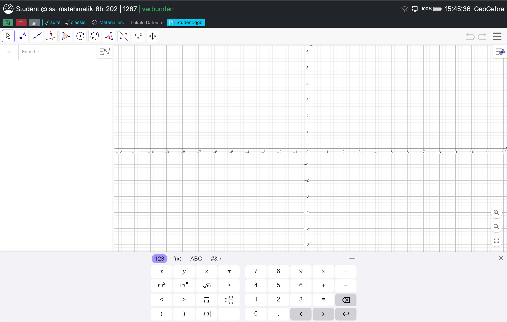

# Prüfungsmodus Mathematik (GeoGebra)

Im Modus **Mathematik** arbeiten die Schüler:innen mit einer lokal eingebetteten, abgesicherten Version von **GeoGebra**.

## Lehrkraft

1. Im Dashboard den Prüfungsmodus **Mathematik** wählen.
2. Es sind keine weiteren Pflichteinstellungen nötig – der Modus ist sofort startbereit.
3. Optional können **Prüfungsmaterialien** (z. B. Formelsammlung als PDF, Bilder, GeoGebra-Dateien `.ggb`) bereitgestellt werden (siehe [Teacher → Prüfungsmaterialien](../teacher.md#prufungsmaterialien-definieren)).
4. Mit **Geräte absichern** wird die Prüfung gestartet.

Die Arbeitsstände der Schüler:innen werden als GeoGebra-Dateien gesichert und können über **Sicherung holen** bzw. die automatische Sicherung abgeholt werden.

## Schüler:in

Nach dem Absichern öffnet sich die GeoGebra-Oberfläche im abgesicherten Vollbildmodus. GeoGebra läuft dabei vollständig lokal (**GeoGebra Web 5.4.920.0** ist in Next-Exam gebündelt) – es ist keine Internetverbindung nötig.

<!-- SCREENSHOT: student_abgesichert_mathe -->
<figure markdown="span">
    {width="70%"}
    <figcaption>Mathematikprüfung mit GeoGebra</figcaption>
</figure>

- **Suite / Classic:** Über die Schaltflächen `suite` und `classic` kann zwischen GeoGebra Suite und GeoGebra Classic gewechselt werden. Standardmäßig startet die Suite.
- Einzelne GeoGebra-Funktionen sind aufgrund der restriktiven Prüfungsumgebung ausgeblendet.
- **Materialien:** Von der Lehrkraft bereitgestellte Dateien und URLs sind über die Seitenleiste erreichbar; die **Spaltenansicht** (Splitview) zeigt Material und GeoGebra nebeneinander.
- **Abgabe:** Die Arbeit wird laufend automatisch als GeoGebra-Datei (`.ggb`) gesichert; die Lehrkraft holt den Arbeitsstand über **Sicherung holen** ab (siehe oben). Über die Toolbar-Funktion **Kopie speichern unter** kann zusätzlich manuell eine Kopie mit eigenem Dateinamen angelegt werden (nur Buchstaben und Zahlen, max. 20 Zeichen).

## Offene Screenshots

| Dateiname | Beschreibung |
|---|---|
| `img/student_abgesichert_mathe.png` | GeoGebra-Oberfläche im abgesicherten Modus |
