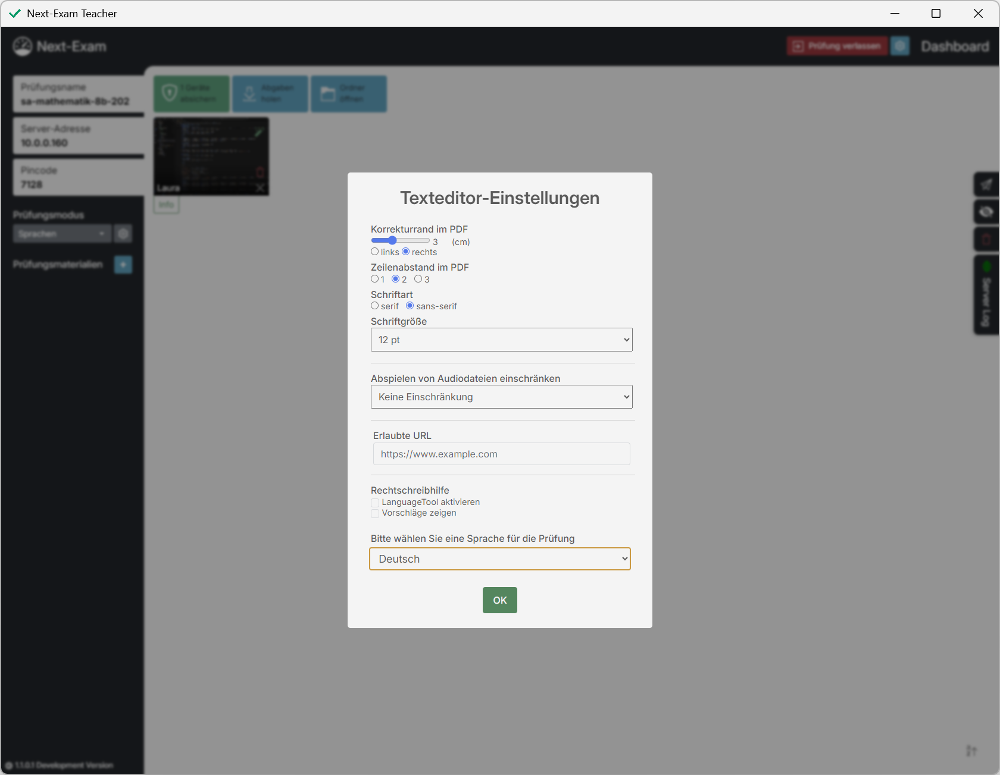
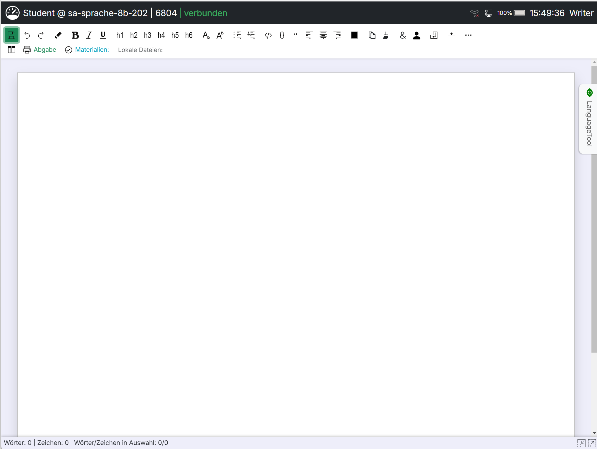
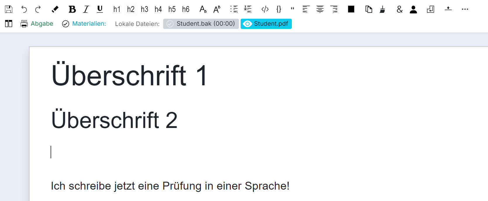
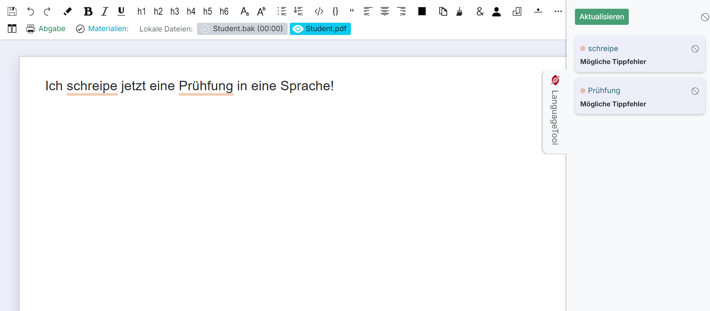
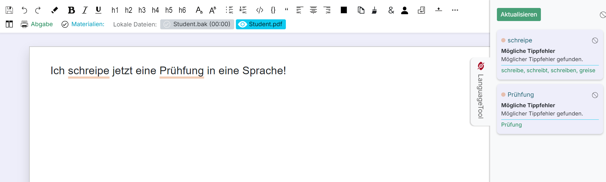
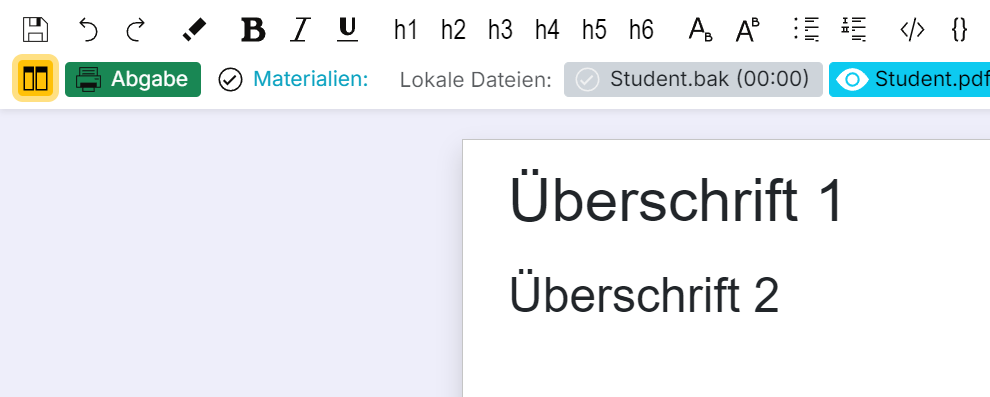
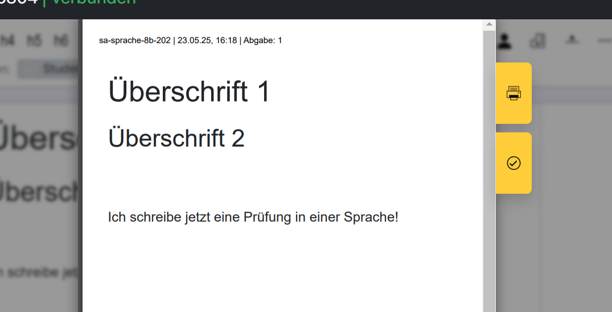

# Prüfungsmodus Sprachen (Texteditor)

Im Modus **Sprachen** schreiben die Schüler:innen in einem abgesicherten Texteditor mit Formatierungsfunktionen, optionaler Rechtschreibhilfe (LanguageTool) und Audio-Unterstützung für Hörverständnis-Aufgaben.

## Lehrkraft

Nach Auswahl des Prüfungsmodus **Sprachen** erscheinen in der Seitenleiste die **Texteditor-Einstellungen**:

<!-- SCREENSHOT: teacher_languages -->
<figure markdown="span">
    {width="50%"}
    <figcaption>Prüfungsmodus „Sprachen“ – Konfiguration</figcaption>
</figure>

- **Sprache:** Sprache der Rechtschreibhilfe (Deutsch, Englisch UK/US, Französisch, Spanisch, Italienisch, Slowenisch oder „andere“) – Startwert für alle Schüler:innen; diese können die Sprache im Editor selbst noch ändern (siehe [LanguageTool-Panel](#languagetool-panel)).
- **LanguageTool:** Aktiviert die passive Rechtschreibhilfe. Mit **Vorschläge zeigen** werden zusätzlich Korrekturvorschläge angezeigt.
- Unter **Erweitert**:
    - **Eigener LT Host:** Optional ein eigener LanguageTool-Server (Host/Port) statt der lokalen Instanz.
    - **Audiodateien:** Anzahl der erlaubten Abspielversuche pro Hörbeispiel (keine Einschränkung oder 1–4×). Die Audiodateien selbst werden als Prüfungsmaterial hinzugefügt.
    - **Korrekturrand im PDF:** Breite des Korrekturrands (2–5 cm) im Abgabe-PDF.
    - **Zeilenabstand im PDF:** 1×, 2× oder 3×.
    - **Schriftart:** serif oder sans-serif.
    - **Schriftgröße:** 8–20 pt.

Diese Einstellungen wirken sich auf den Editor und das erzeugte Abgabe-PDF aus.

- **Template:** Optional kann eine Vorlage (`.odt` oder `.docx`) gewählt werden, die beim Prüfungsstart in den Editor der Schüler:innen geladen wird. Bei aktivierten Gruppen getrennt für A und B.
- **Prüfungsmaterialien:** Dateien (z. B. Wörterbuch-PDF, Audiodateien) und URLs, die während der Prüfung verfügbar sind.

### Zeitstrahl / Bearbeitungsverlauf

Aus den regelmäßig geholten Sicherungen kann die Lehrkraft pro Schüler:in einen **Bearbeitungsverlauf** erzeugen (Diff-Ansicht über alle `.htm`-Sicherungen):

- Schrittweises Durchblättern der Sicherungen („Sicherung x von y“) oder automatisches Abspielen der Schrittfolge.
- Änderungen zwischen den Sicherungen werden farblich hervorgehoben, inklusive Wortstatistik.
- Der Verlauf kann als `<name>_editor_timeline.json` gespeichert werden.

So lässt sich der Entstehungsprozess eines Textes nachvollziehen.

## Schüler:in

Nach dem Absichern öffnet sich der Texteditor im Vollbild.

<!-- SCREENSHOT: student_abgesichert_sprache -->
<figure markdown="span">
    {width="70%"}
    <figcaption>Sprachenprüfung – Texteditor</figcaption>
</figure>

### Toolbar-Funktionen

<!-- SCREENSHOT: student_abgesichert_sprache_toolbar -->
<figure markdown="span">
    {width="70%"}
    <figcaption>Symbolleiste des Texteditors</figcaption>
</figure>

- **sichern** – speichert den aktuellen Arbeitsstand (zusätzlich wird automatisch gesichert).
- **rückgängig / wiederholen** – widerruft bzw. wiederholt Änderungen.
- **fett, kursiv, unterstrichen, hochgestellt, tiefgestellt** – Zeichenformatierung; **Formatierung löschen** entfernt sie wieder.
- **Überschrift 1–6** – Formatvorlagen für Überschriften.
- **ungeordnete / geordnete Liste, Zitat, Codeblock, Trennlinie** – Absatzformate.
- **linksbündig, zentriert, rechtsbündig, Blocksatz** – Textausrichtung.
- **Textfarbe** – Farbe des markierten Textes.
- **Tabelle einfügen** – mit Funktionen für Zeilen/Spalten, Titelzeile und Zellen vereinen/teilen.
- **Sonderzeichen einfügen**, **Seitenumbruch**, **Zählerzeile** (Zeichen-/Wortzähler pro Abschnitt).
- **Spaltenansicht (Splitview)** – zeigt Prüfungsmaterialien neben dem Editor an.
- **Zoom** – Ansicht vergrößern/verkleinern.
- Wort- und Zeichenanzahl (gesamt und in der Auswahl) werden laufend angezeigt.

### LanguageTool-Panel

Hat die Lehrkraft LanguageTool aktiviert, erscheint ein Seitenbereich mit der Rechtschreibprüfung:

<!-- SCREENSHOT: student_sprache_languagetool -->
<figure markdown="span">
    {width="50%"}
    <figcaption>LanguageTool ohne Vorschläge</figcaption>
</figure>

- Ohne Vorschläge werden mögliche Fehler nur markiert.
- Mit **Vorschläge zeigen** werden zusätzlich Verbesserungsvorschläge angeboten.

<!-- SCREENSHOT: student_sprache_languagetool_vorschlaege -->
<figure markdown="span">
    {width="50%"}
    <figcaption>LanguageTool mit Vorschlägen</figcaption>
</figure>

- Über **Lokal / Extern** kann zwischen dem lokal mitgelieferten LanguageTool und dem von der Lehrkraft konfigurierten externen Server gewechselt werden; **Aktualisieren** stößt eine neue Prüfung an.
- Über ein Dropdown im Panel kann die Person die **Sprache der Rechtschreibhilfe** selbst ändern (Deutsch, Englisch UK/US, Französisch, Spanisch, Italienisch, Slowenisch).

!!! warning "Nur lokal gültig"
    Diese Auswahl gilt nur lokal für die aktuelle Sitzung und wird bei einem Abschnittswechsel oder erneutem Verbinden wieder auf die von der Lehrkraft eingestellte Sprache zurückgesetzt.

### Prüfungsmaterialien und Audio

- Bereitgestellte **Materialien** (Dateien, URLs) sind über die Seitenleiste abrufbar; **Materialien aktualisieren** lädt die aktuelle Liste vom Server.
- **Hörbeispiele** werden über „Audio abspielen“ gestartet; die verbleibenden Durchläufe werden angezeigt, sofern die Lehrkraft die Abspielversuche begrenzt hat.

### Abgabe

<!-- SCREENSHOT: student_sprache_abgabe -->
<figure markdown="span">
    {width="50%"}
    <figcaption>Abgabe der Arbeit</figcaption>
</figure>

- **Arbeit an Lehrperson senden:** Erzeugt aus dem Text ein PDF (mit den von der Lehrkraft vorgegebenen Einstellungen wie Korrekturrand und Schriftbild) und überträgt es an den Teacher. Für die finale Abgabe steht **Finale Abgabe an Lehrperson senden** zur Verfügung.
- **drucken:** Sendet eine Druckanfrage an die Lehrperson bzw. druckt direkt, wenn der autonome Druck freigegeben ist.
- Abgaben werden automatisch signiert (siehe [Erweiterte Funktionen → Signierte PDFs validieren](../advanced.md#signierte-pdfs-validieren)).

<!-- SCREENSHOT: student_sprache_abgabe_dialog -->
<figure markdown="span">
    {width="50%"}
    <figcaption>Abgabe-Dialog</figcaption>
</figure>

## Offene Screenshots

| Dateiname | Beschreibung |
|---|---|
| `img/teacher_languages.png` | Teacher: Texteditor-Einstellungen in der Seitenleiste |
| `img/student_abgesichert_sprache.png` | Texteditor im abgesicherten Modus |
| `img/student_abgesichert_sprache_toolbar.png` | Symbolleiste des Texteditors |
| `img/student_sprache_languagetool.png` | LanguageTool-Panel ohne Vorschläge |
| `img/student_sprache_languagetool_vorschlaege.png` | LanguageTool-Panel mit Vorschlägen |
| `img/student_sprache_abgabe.png` | Abgabe-Buttons im Editor |
| `img/student_sprache_abgabe_dialog.png` | Dialog beim Senden der Abgabe |
