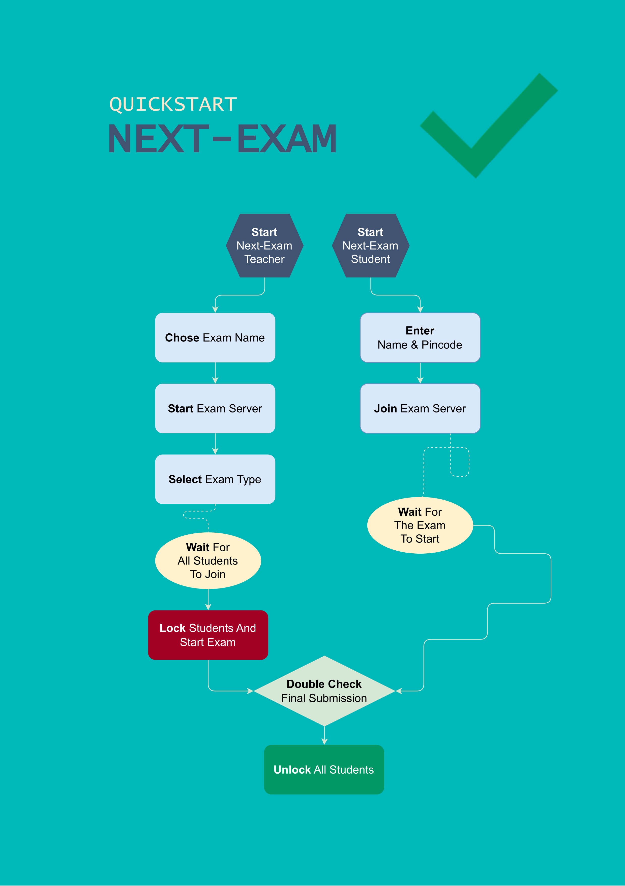

# Quickstart

Der schnellste Weg zur ersten Prüfung mit Next-Exam – in sechs Schritten.

<!-- SCREENSHOT: quickstart -->
<figure markdown="span">
    {width="100%"}
    <figcaption>Quickstart-Überblick</figcaption>
</figure>

## 1. Teacher starten und Prüfung anlegen

1. **Next-Exam Teacher** starten und auf der Startseite den Tab **Lokale Prüfung** wählen.
2. Einen **Prüfungsnamen** vergeben (erlaubt: a–z, A–Z, 0–9, `-` und `_`, max. 20 Zeichen).
3. Optional unter **Erweitert** ein **Passwort** und ein **Backupverzeichnis** festlegen.
4. Auf **Prüfung starten** klicken. Falls mehrere Netzwerkschnittstellen vorhanden sind, die gewünschte Schnittstelle auswählen.

Das Dashboard öffnet sich und zeigt den **Pincode** sowie die **Server-Adresse** an.

## 2. Prüfungsmodus wählen

Im Dashboard über das Dropdown **Prüfungsmodus** den gewünschten Modus wählen (z. B. Mathematik, Sprachen, Active Sheets). Je nach Modus erscheinen in der Seitenleiste die passenden Einstellungen. Optional **Prüfungsmaterialien** (Dateien, URLs) hinzufügen.

## 3. Schüler:innen verbinden

1. **Next-Exam Student** starten – im Netzwerk gefundene Prüfungen werden automatisch angezeigt.
2. Prüfung anklicken, **Name** eingeben und den **Pincode** vom Teacher-Dashboard eintragen.
3. Auf **anmelden** klicken.

Wird die Prüfung nicht automatisch gefunden, kann über **Manuell suchen** die Server-Adresse eingegeben werden.

## 4. Prüfung starten

Im Teacher-Dashboard den grünen Button **Geräte absichern** klicken. Alle verbundenen Geräte wechseln in den abgesicherten Prüfungsmodus und öffnen die gewählte Prüfungsumgebung.

## 5. Abgabe

Je nach Modus geben die Schüler:innen ihre Arbeit direkt ab (Senden/Drucken), zusätzlich kann die Lehrkraft jederzeit über **Sicherung holen** alle aktuellen Arbeitsstände anfordern. Abgaben landen im Arbeitsordner der Prüfung (Unterordner `ABGABE`) und sind über die **Abgabenübersicht** einsehbar.

## 6. Prüfung beenden

1. **Geräte freigeben** klicken – die Schüler:innen-Geräte verlassen den abgesicherten Modus.
2. Über **Prüfung verlassen** den Prüfungsserver beenden.

Die Prüfung bleibt lokal gespeichert und kann später über **Prüfung fortsetzen** wieder aufgenommen werden.
