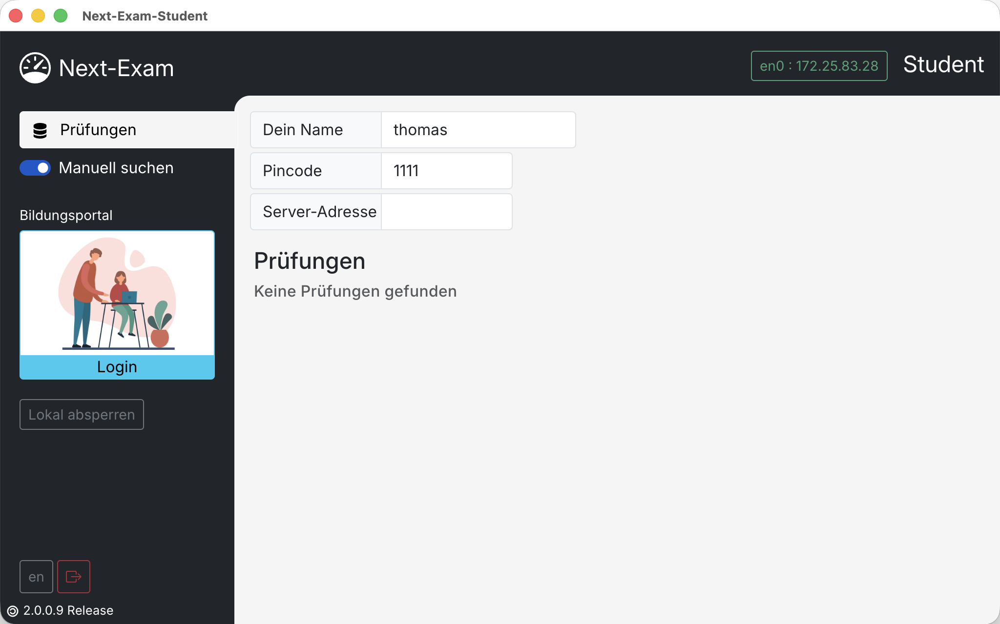
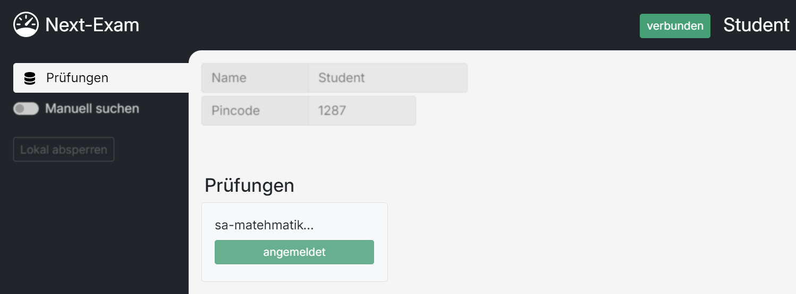
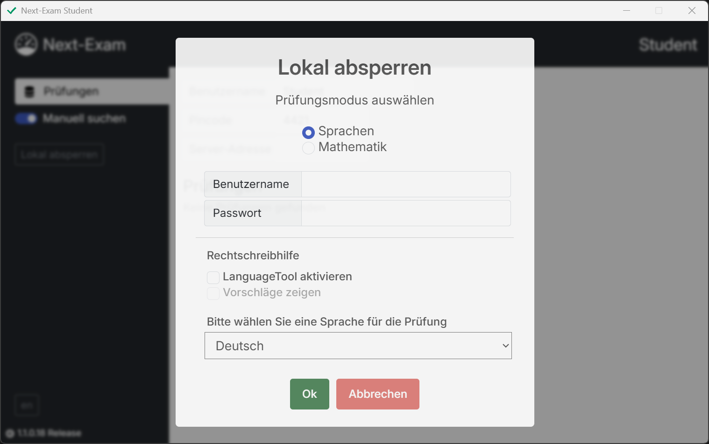
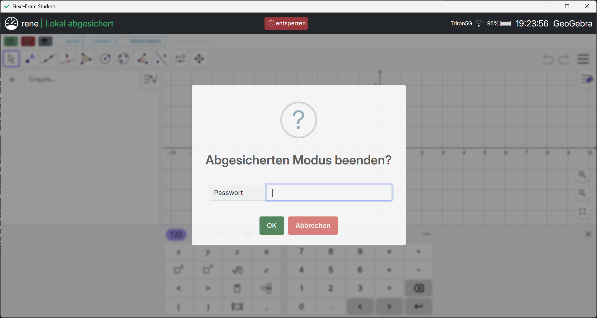

# Student – Grundlegende Funktionen

Die Student-App verbindet das Schüler:innen-Gerät mit dem Prüfungsserver der Lehrkraft und führt die Prüfung im abgesicherten Modus durch.

---

## Prüfung finden

Nach dem Start sucht Next-Exam Student automatisch im lokalen Netzwerk nach aktiven Prüfungen und listet sie unter **Prüfungen** auf. Die gewünschte Prüfung wird angeklickt; danach werden **Name** und der von der Lehrkraft mitgeteilte **Pincode** eingegeben.

<!-- SCREENSHOT: student_exam_anmelden -->
<figure markdown="span">
    {width="50%"}
    <figcaption>Bei einer Prüfung anmelden</figcaption>
</figure>

## Manuelle Serveradresse eingeben

Erscheint die Prüfung nicht automatisch (z. B. wegen Firewall oder getrennter Netzsegmente), wird über den Schalter **Manuell suchen** das Feld **Server-Adresse** eingeblendet. Dort wird die im Teacher-Dashboard angezeigte Adresse eingetragen.

## Anmelden

Ein Klick auf **anmelden** stellt die Verbindung her:

- Der **Name** wird automatisch normalisiert (Kleinschreibung) und muss innerhalb der Prüfung eindeutig sein – ist er bereits vergeben, erscheint eine Fehlermeldung.
- Der **Pincode** besteht aus genau vier Ziffern.
- Bei abweichenden Programmversionen von Teacher und Student wird die Anmeldung verweigert („Die Programmversionen stimmen nicht überein“). In diesem Fall dieselbe Version wie am Prüfungsserver installieren.

!!! warning "Mehrere Monitore"
    Mehrere angeschlossene Monitore sind für die Prüfung nicht zulässig; zusätzliche Bildschirme müssen vor dem Start getrennt werden.

Nach erfolgreicher Anmeldung erscheint der Hinweis, auf die Aktivierung des Prüfungsmodus durch die Lehrperson zu warten.

<!-- SCREENSHOT: student_verbunden -->
<figure markdown="span">
    {width="50%"}
    <figcaption>Erfolgreich mit dem Prüfungsserver verbunden</figcaption>
</figure>

## Verbindungsstatus

Die App zeigt den aktuellen Verbindungszustand an:

- **verbunden** – die Verbindung zum Prüfungsserver besteht.
- **Verbindung unterbrochen / offline** – die Verbindung ist abgerissen. Im abgesicherten Modus kann trotzdem weitergearbeitet werden; Sicherungen werden nach dem Wiederverbinden übertragen. Ändert sich die eigene IP-Adresse, weist ein Hinweis darauf hin, **Neu verbinden** zu nutzen.
- **Kein Prüfungsserver an der angegebenen Adresse / Server API nicht erreichbar** – unter der eingegebenen Adresse antwortet kein Next-Exam-Server (Adresse prüfen, Firewall beachten).

## Anmeldung über das Bildungsportal

Statt Name und Pincode manuell einzugeben, kann sich die Prüfungsperson auch über das österreichische **Bildungsportal** anmelden – siehe [Bildungsportal](bildungsportal.md#als-schulerin-anmelden). Next-Exam übernimmt dabei automatisch den Namen aus dem Portal-Konto und verbindet die Person mit der passenden, von der Lehrkraft vorbereiteten Prüfung. Hat die Lehrkraft **Bildungsportal Login erzwingen** aktiviert, ist diese Anmeldeart verpflichtend.

## Gruppen A/B

Hat die Lehrkraft Gruppen aktiviert, zeigt die Student-App die eigene Gruppenzugehörigkeit (**A** oder **B**) im Kopfbereich an. Materialien und Modus-Einstellungen können sich je nach Gruppe unterscheiden.

## Prüfungsmodus wird durch die Lehrkraft aktiviert

Den Prüfungsmodus (Mathematik, Sprachen, Web, Active Sheets …) wählt ausschließlich die Lehrkraft. Sobald sie **Geräte absichern** auslöst, wechselt das Gerät in den abgesicherten Modus und öffnet die entsprechende Prüfungsumgebung – siehe die einzelnen [Prüfungsmodi](modes/mathematik.md). Der abgesicherte Modus darf nie ohne Freigabe durch die Lehrperson verlassen werden; ein Verlassen wird der Lehrkraft gemeldet.

## Lokal absperren

Wenn einzelne Geräte ohne Teacher-Instanz abgesichert werden sollen, steht auf der Startseite die Funktion **Lokal absperren** zur Verfügung. Im Dialog werden festgelegt:

- **Prüfungsmodus:** Sprachen (Texteditor) oder Mathematik (GeoGebra)
- **Name** der arbeitenden Person
- **Passwort** (mit Bestätigung) – wird zum Verlassen des abgesperrten Modus benötigt
- Bei Sprachen zusätzlich: **LanguageTool aktivieren**, **Vorschläge zeigen** und die Sprache der Rechtschreibhilfe

<!-- SCREENSHOT: loc_local_settings -->
<figure markdown="span">
    {width="50%"}
    <figcaption>Dialog „Lokal absperren“</figcaption>
</figure>

Zum Verlassen des abgesperrten Modus ist die Eingabe des zuvor definierten Passworts notwendig.

<!-- SCREENSHOT: loc_local_exit -->
<figure markdown="span">
    {width="50%"}
    <figcaption>Passworteingabe beim Verlassen</figcaption>
</figure>

## Kiosk-Modus einrichten

Zusätzlich zur eigentlichen Prüfungsumgebung kann das Gerät auf Betriebssystemebene abgesichert werden (eigenes gesperrtes Benutzerkonto unter Windows bzw. eigene Kiosk-Sitzung unter Linux). Die entsprechende Schaltfläche **Kiosk-Modus einrichten** findet sich ebenfalls auf der Startseite – siehe [Kiosk-Modus](modes/kiosk.md).

## Offene Screenshots

| Dateiname | Beschreibung |
|---|---|
| `img/student_exam_anmelden.png` | Anmeldemaske mit Prüfungsliste, Name und Pincode |
| `img/student_verbunden.png` | Statusanzeige nach erfolgreicher Anmeldung |
| `img/loc_local_settings.png` | Dialog „Lokal absperren“ |
| `img/loc_local_exit.png` | Passworteingabe beim Verlassen des lokalen Modus |
