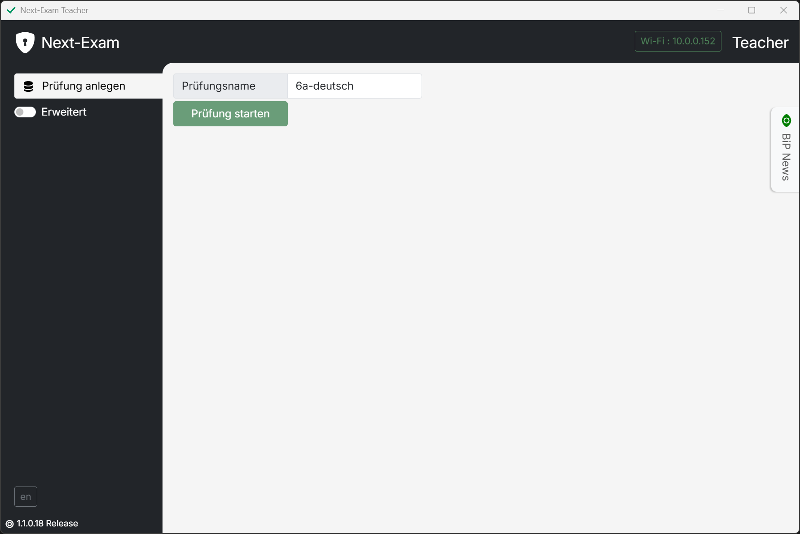
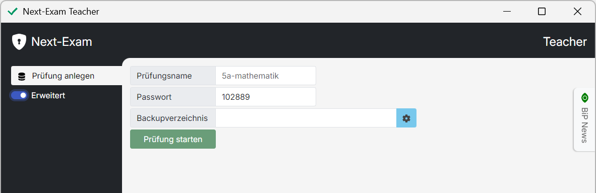
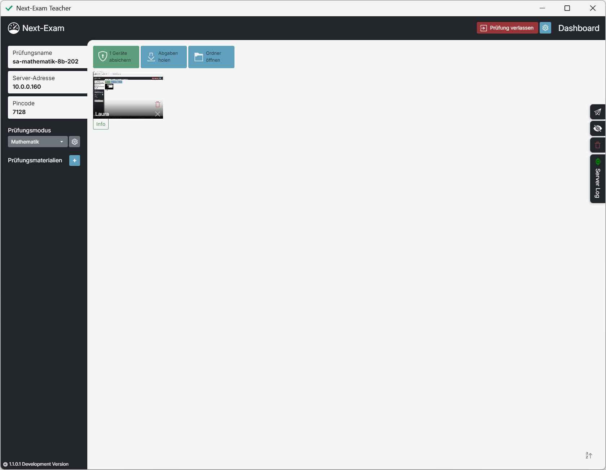
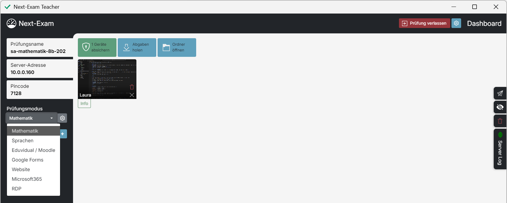
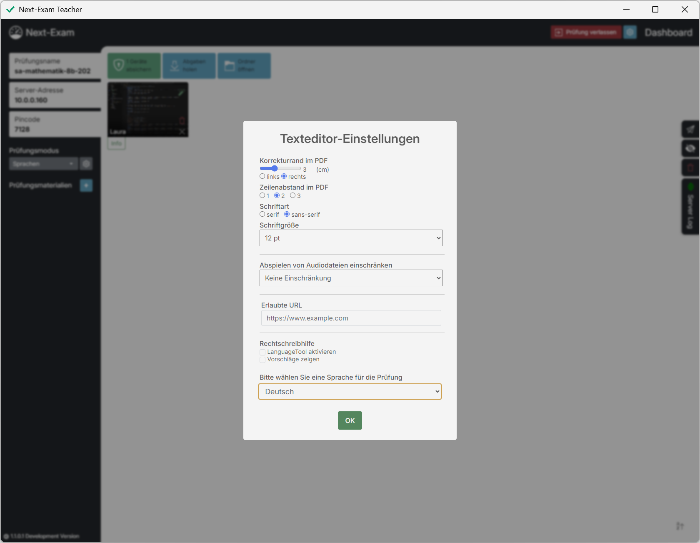
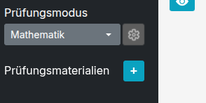
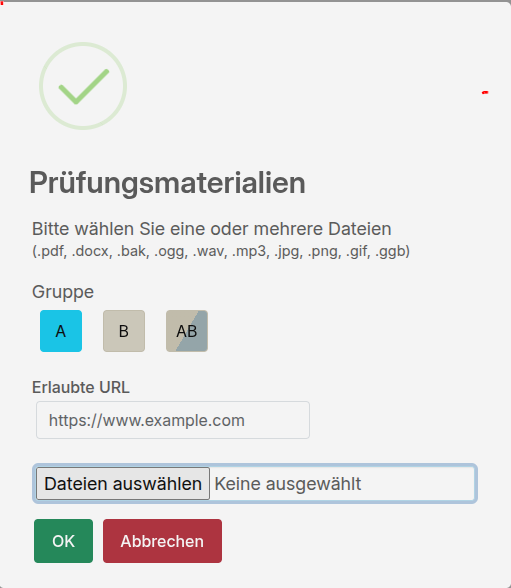
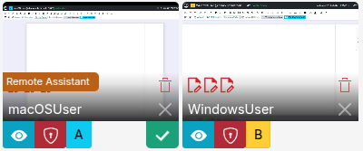
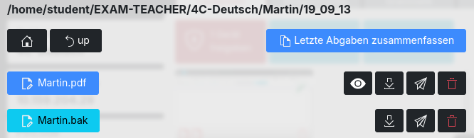

# Teacher – Grundlegende Funktionen

## Prüfungen anlegen

> Der `Prüfungsname` kann frei gewählt werden. Der Arbeitsordner am Desktop beinhaltet alle archivierten Arbeiten und Abgaben sowie die Prüfungsordner und die Prüfungs-Konfiguration.

<figure markdown="span">
    {width="50%"}
    <figcaption>Prüfung anlegen, Prüfungsserver starten</figcaption>
</figure>

### Passwort festlegen (optional)

> Ein `Passwort` kann festgelegt werden, um zu verhindern, dass Schüler:innen die Prüfung bei Verbindungsverlust ohne Kenntnis des `Passwort`-Wertes verlassen können.

### Backupverzeichnis festlegen (optional)

> Das `Backupverzeichnis` kann individuell gewählt werden (z. B. Netzwerkordner, USB-Stick). Hier werden die Prüfungsdaten zusätzlich zum Arbeitsordner gespeichert.

<figure markdown="span">
    {width="50%"}
    <figcaption>Passwort, Backupverzeichnis</figcaption>
</figure>

---

## Dashboard

Das Teacher-Dashboard bietet eine Übersicht über alle verbundenen Schüler:innen-Geräte und stellt alle prüfungsrelevanten Informationen dar.  
Es ermöglicht sowohl die Konfiguration der Prüfung als auch die Verwaltung der Schüler:innen.

<figure markdown="span">
    {width="50%"}
    <figcaption>Dashboard</figcaption>
</figure>

Der automatisch generierte `Pincode` wird von den Schüler:innen benötigt, um der Prüfung beizutreten. Sollte die Prüfung nicht erscheinen, kann alternativ die `Server-Adresse` eingegeben werden.

---

## Prüfungsmodi

> Next-Exam ermöglicht verschiedene Prüfungsvarianten.

<figure markdown="span">
    {width="50%"}
    <figcaption>Prüfungsmodi</figcaption>
</figure>

Verfügbare Prüfungsmodi:

- `Mathematik` – mit GeoGebra-Integration  
- `Sprachen` – Texteditor mit erweiterten Features  
- `Eduvidual/Moodle` – LMS-Test im Kiosk-Modus  
- `Google Forms` – Formular im Kiosk-Modus  
- `Microsoft 365` – Online-Versionen von Word, Excel usw.  
- `Website` – Beliebige Webseite im Kiosk-Modus  
- `RDP` – RD Web Client

> Die Auswahl des `Prüfungsmodus` erfolgt über das gleichnamige Dropdown-Feld. Je nach Modus erscheint ein angepasstes Konfigurationsfenster.  
> Änderungen der Konfiguration über das Zahnrad-Symbol (oben rechts) sind nur möglich, solange die Prüfung noch nicht gestartet wurde.

---

## Modusspezifische Einstellungen

### Sprachen

<figure markdown="span">
    {width="50%"}
    <figcaption>Prüfungsmodus "Sprachen" – Konfiguration</figcaption>
</figure>

> Einstellungen wie Korrekturrand, Schriftart, Zeilenabstand und Schriftgröße betreffen sowohl den Editor als auch das erzeugte Abgabe-PDF.  
> Audiodateien können ausgewählt und deren erlaubte Abspielversuche begrenzt werden.  
> Zusätzliche Hilfsmittel wie Webseiten oder Dateien (z. B. Wörterbuch) werden im Bereich `Prüfungsmaterialien` definiert.  
> Eine passive Rechtschreibhilfe über `LanguageTool` kann aktiviert und konfiguriert werden.

### Mathematik

> Schüler:innen arbeiten mit GeoGebra Classic/Suite.  
> Zusätzliche Hilfsmittel (z. B. Formelsammlung) werden über `Prüfungsmaterialien` bereitgestellt.

### Eduvidual/Moodle

Next-Exam übernimmt die Absicherung des Moodle-Tests.  
Alle prüfungsrelevanten Einstellungen erfolgen direkt in Moodle.

### Webseiten

Im Webseiten-Modus kann jede gewünschte Seite abgesichert angezeigt werden  
(z. B. digi4school.at, lms.at, scratch.mit.edu).

### Google Forms

Google Forms können direkt in einem abgesicherten Kiosk-Modus geöffnet werden.

### Microsoft365

Nach dem Login wird ein .docx- bzw. .xlsx-Template bereitgestellt.  
Für jede:n Schüler:in wird automatisch eine Kopie im OneDrive der Lehrperson erzeugt – inklusive individueller Bearbeitungslinks.

### RDP

Über ein Windows Remote Desktop Gateway kann auf einen Windows-Server oder virtuelle Maschinen zugegriffen werden.

> Als Lehrperson ist der `Domainnamen (URL)` des Servers anzugeben.  
> Schüler:innen melden sich mit ihrem Domänen-Login an.  
> Auf dem Server muss der RD Web Client installiert sein.

---

## Prüfung starten

Der grüne Button `Geräte absichern` startet die Prüfung.  
Schüler:innen-Endgeräte wechseln in den abgesicherten Modus.

---

## Prüfungsmaterialien und URLs

### Prüfungsmaterialien bereitstellen

<figure markdown="span">
    {width="50%"}
    <figcaption>Prüfungsmaterialien – Übersicht</figcaption>
</figure>

> Materialien (Textdokumente, PDFs, Formelsammlungen, Wörterbücher, Audiodateien, Bilder) sowie URLs werden über das `+`-Icon hinzugefügt.

<figure markdown="span">
    {width="50%"}
    <figcaption>Dialog zum Hinzufügen von Materialien</figcaption>
</figure>

> Die Auswahl erfolgt im Dialogfenster.  
> Mit `OK` wird das neue `Prüfungsmaterial` der Liste hinzugefügt.  
> Einträge können über das `X` wieder entfernt werden.

### Gruppen- und Einzelschüler-Zuweisung

> Der Bereich `Gruppen` steht nur zur Verfügung, wenn Gruppen aktiviert wurden  
> (siehe *Erweiterte Funktionen*).

Materialien werden in Base64 an die Clients übertragen und nicht lokal gespeichert.  
Änderungen sind auch während der Prüfung möglich.

---

## Dateien bereitstellen

Next-Exam bietet mehrere Möglichkeiten zum Dateiversand:

> Über die Sidebar können Dateien an alle Schüler:innen gesendet werden.  
> Über den Dateimanager können Backups an einzelne Personen übermittelt werden.  
> Gesendete Dateien stehen auch im abgesicherten Modus zur Verfügung.

### Sicherungen zurücksenden

Der Dateimanager erlaubt das gezielte Senden einzelner Dateien an bestimmte Schüler:innen – z. B. `.bak`-Dateien des Editors.

---

## Schüler verwalten

### Sitzplan

Das Dashboard fungiert als Sitzplan.  
Schüler:innen können per Drag & Drop neu positioniert werden.

### Student-Widget

<figure markdown="span">
    {width="50%"}
    <figcaption>Student-Widgets</figcaption>
</figure>

Über das Student-Widget lassen sich Einstellungen für einzelne Schüler:innen vornehmen:

- `Info`: Detailansicht (Freischalten, Entfernen, Dateiversand, Abgaben)  
- `A` / `B`: Gruppenzuweisung (sofern aktiviert)  
- `X`: Prüfung für die Person beenden  
- `Papierkorb`: Arbeitsordner der Person bereinigen  
- `Zauberstab`: Rechtschreibhilfe aktivieren  
- Rote Dokumentensymbole: Anzahl erstellter Dateien

Weitere Symbole erscheinen bei:

- Abgabeversand  
- Nutzung einer `Virtualisierten Arbeitsumgebung`  
- Verlassen der Prüfung

---

## Abgaben einsehen und sichern

Der Dateimanager (Schaltfläche `Ordner öffnen`) erlaubt das Einsehen und Verwalten aller Abgaben.

<figure markdown="span">
    {width="50%"}
    <figcaption>Dateimanager</figcaption>
</figure>

### Verwaltung der Prüfungsabgaben

- Einsicht des Schülerfortschritts  
- Archivierung und Download  
- Automatische Archivierung mit Timestamp  
- Zusammenfassung der neuesten Abgaben als PDF  
  > Hinweis: Derzeit enthält das PDF nur die jeweils letzte eingereichte Datei. Dieses Verhalten wird zukünftig verbessert.

### Abgabe

Abgegebene Dateien befinden sich im Ordner `ABGABE`:

- Finale Abgabe mit Nummerierung und Namenskennzeichnung  
- Automatischer Versand an den Teacher  
- Automatische Ablage

### Direktdruck

- Möglichkeit zum Sofortdruck durch Schüler:innen  
- Auswahl eines Standarddruckers

---

## Prüfung beenden

Die Prüfung wird über die rote Schaltfläche **„Gerät freigeben“** beendet.  
Das Schüler:innen-Gerät verlässt den abgesicherten Modus und zeigt die Meldung:

> *„Wollen Sie die Anwendung Next-Exam beenden?“*
