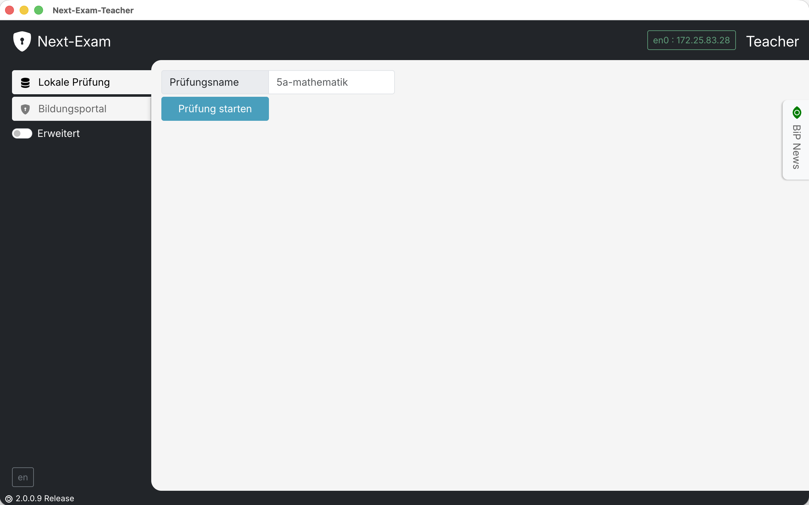
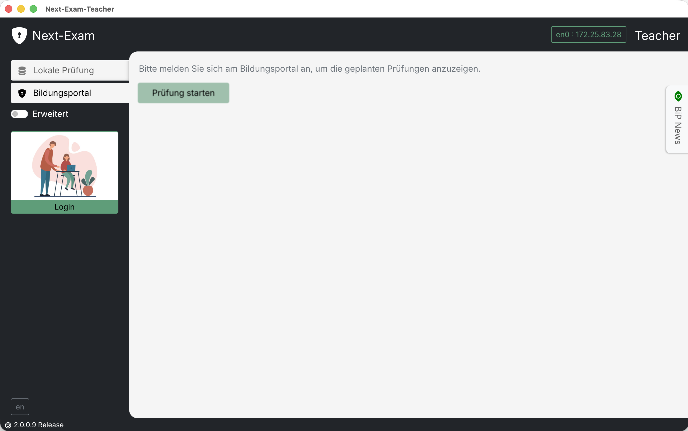
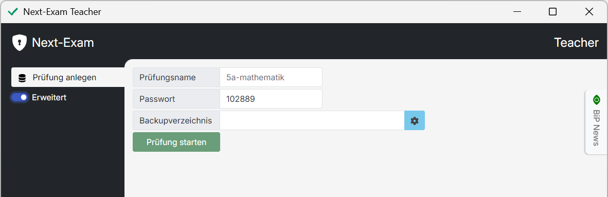
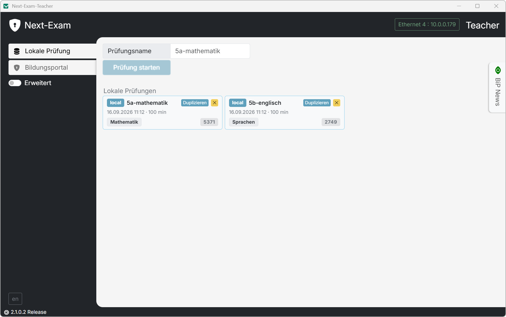
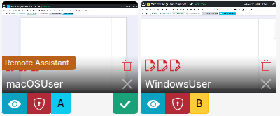
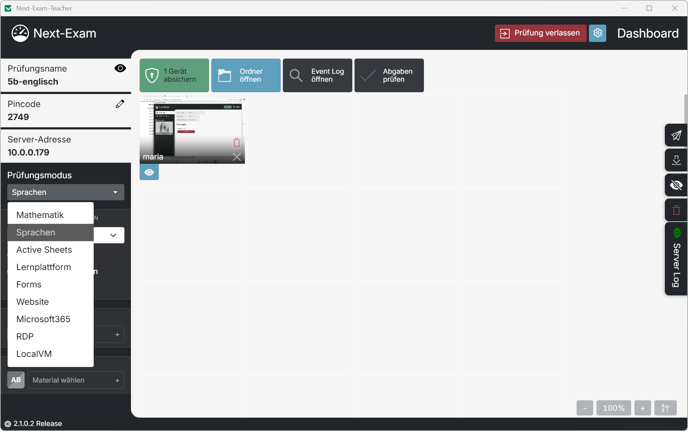
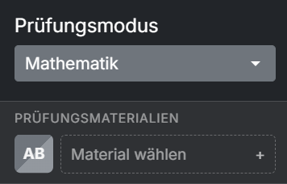
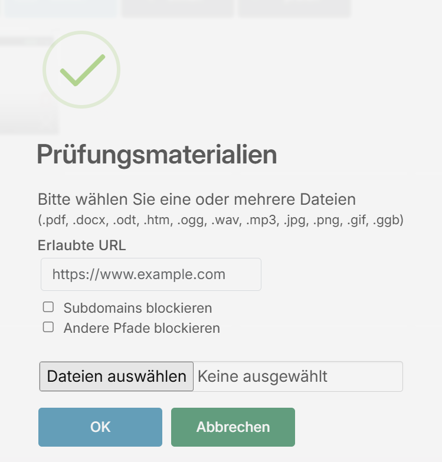
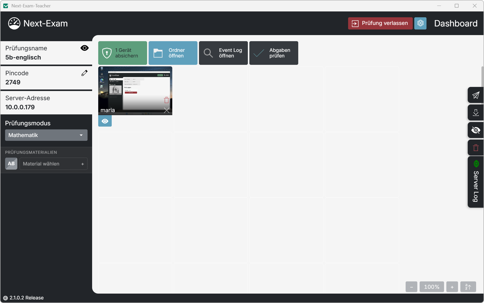
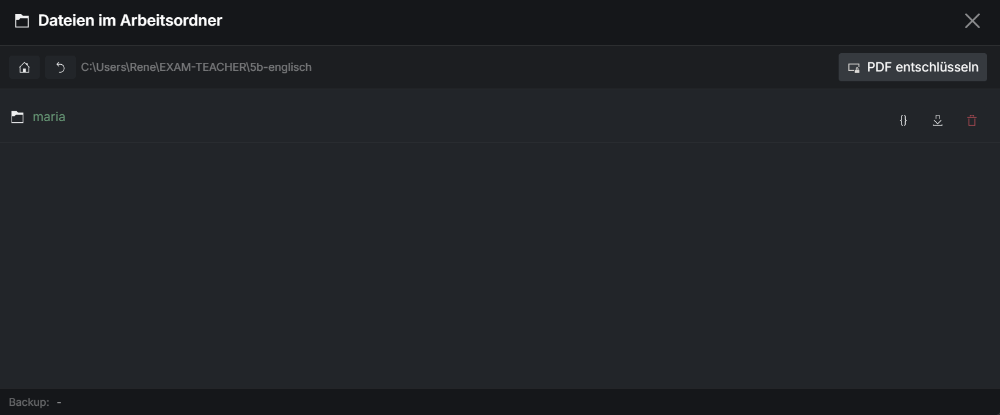

# Teacher – Grundlegende Funktionen

Die Teacher-App legt Prüfungen an, verwaltet die verbundenen Schüler:innen-Geräte und überwacht die laufende Prüfung.

---

## Prüfungsserver starten

Auf der Startseite stehen zwei Tabs zur Verfügung: **Lokale Prüfung** und **Bildungsportal**. Im Tab **Lokale Prüfung** wird die Prüfung direkt in der Teacher-App konfiguriert (siehe unten); im Tab **Bildungsportal** wird eine bereits im österreichischen Bildungsportal vorbereitete Prüfung geladen – siehe [Bildungsportal](bildungsportal.md).

<figure markdown="span">
    {width="100%"}
    <figcaption>Lokale Prüfung erstellen und starten</figcaption>
</figure>
<figure markdown="span">
    {width="100%"}
    <figcaption>Prüfung über das Bildungsportal starten</figcaption>
</figure>

### Prüfungsname

Der **Prüfungsname** kann frei gewählt werden. Erlaubt sind die Zeichen a–z, A–Z, 0–9, `-` und `_` (max. 20 Zeichen). Für jede Prüfung wird im Arbeitsverzeichnis **EXAM-TEACHER** ein eigener Prüfungsordner mit allen Sicherungen, Abgaben und der Prüfungskonfiguration angelegt.

### Passwort festlegen (optional)

Über den Schalter **Erweitert** kann ein **Passwort** (mit Bestätigung) festgelegt werden. Schüler:innen können den abgesicherten Modus auch bei Verbindungsverlust nicht ohne dieses Passwort verlassen.

!!! warning "Standardkennwort"
    Wird kein eigenes Passwort festgelegt, verwendet Next-Exam das Standardkennwort **`next-exam`**. Für sensible Prüfungen sollte daher immer ein individuelles Passwort vergeben werden.

### Backupverzeichnis festlegen (optional)

Im erweiterten Modus kann zusätzlich ein **Backupverzeichnis** gewählt werden (z. B. Netzwerkordner oder USB-Stick). Dort wird eine Kopie des Arbeitsverzeichnisses abgelegt.

<!-- SCREENSHOT: teacher_exam_advanced -->
<figure markdown="span">
    {width="50%"}
    <figcaption>Passwort und Backupverzeichnis (Erweitert)</figcaption>
</figure>

### Netzwerkschnittstelle wählen

Besitzt der Rechner mehrere aktive Netzwerkschnittstellen (z. B. LAN und WLAN), fragt Next-Exam beim Start nach der bevorzugten Schnittstelle. Über diese Schnittstelle wird der Prüfungsserver im Netzwerk bekannt gemacht.

### Prüfung fortsetzen

Unter **Lokale Prüfungen** werden alle bereits angelegten Prüfungen aufgelistet. Ein Klick auf den Prüfungsnamen setzt die Prüfung mit allen Einstellungen und Daten fort. Das `x`-Symbol löscht den lokalen Prüfungsordner. Prüfungen aus nicht kompatiblen Programmversionen werden entsprechend markiert.

---

## Dashboard

Das Dashboard bietet eine Übersicht über alle verbundenen Geräte und stellt alle prüfungsrelevanten Informationen und Aktionen bereit.

<!-- SCREENSHOT: teacher_dashboard-01 -->
<figure markdown="span">
    {width="80%"}
    <figcaption>Next-Exam Teacher – Dashboard</figcaption>
</figure>

- **Pincode:** Der automatisch generierte vierstellige Pincode wird von den Schüler:innen zur Anmeldung benötigt. Über **Pincode ändern** kann er angepasst werden; **Anmeldeinformationen anzeigen** blendet Pincode und Server-Adresse groß ein.
- **Server-Adresse:** Wird die Prüfung im Netzwerk nicht automatisch gefunden, geben die Schüler:innen diese Adresse manuell ein.
- **Status der Geräte:** Jedes verbundene Gerät erscheint als Widget mit Namen, Screenshot und Statusanzeigen (verbunden/offline, abgesichert, Fokus verloren, Virtualisierung erkannt, Remote-Assistant-Warnung u. a.).
- **Sitzplan:** Die Widgets können per Drag & Drop angeordnet werden; alternativ sortiert **Student Widgets alphabetisch sortieren** automatisch.
- **Server-Log:** Über das Log-Symbol lässt sich das Server-Protokoll ein- und ausblenden.

---

## Schüler:innen-Widget

<!-- SCREENSHOT: teacher_student_widget -->
<figure markdown="span">
    {width="50%"}
    <figcaption>Student-Widget mit Einzelaktionen</figcaption>
</figure>

Über das Widget stehen pro Schüler:in folgende Funktionen zur Verfügung:

- **Info / Details:** Detailansicht mit Live-Screenshot und Einzelaktionen.
- **Sicherung holen:** Aktuellen Arbeitsstand (Backup und Log-Dateien) der Person anfordern.
- **Datei senden:** Einzelne Dateien gezielt an diese Person übertragen.
- **Screenshot speichern:** Aktuellen Screenshot im Ordner `screenshots` ablegen.
- **Gerät absichern / freigeben:** Abgesicherten Modus für dieses eine Gerät starten oder beenden.
- **A / B:** Gruppenzuweisung (sofern Gruppen aktiviert sind, siehe [Erweiterte Funktionen](advanced.md#gruppen-ab)).
- **Verbindung trennen (Kick):** Person vom Prüfungsserver entfernen. Liegt noch keine Abgabe (PDF) vor, warnt Next-Exam davor.
- **Arbeitsordner bereinigen:** Arbeitsordner auf dem Gerät der Person leeren.

Zusätzliche Symbole erscheinen bei Ereignissen wie eingegangener Abgabe, erkannter virtualisierter Arbeitsumgebung, belegtem LanguageTool-Port oder dem Versuch, den abgesicherten Modus zu verlassen.

---

## Prüfungsmodus wählen

<!-- SCREENSHOT: teacher_dashboard-02 -->
<figure markdown="span">
    {width="50%"}
    <figcaption>Auswahl des Prüfungsmodus</figcaption>
</figure>

Die Auswahl erfolgt über das Dropdown **Prüfungsmodus**:

- **Mathematik** – GeoGebra Suite/Classic ([Details](modes/mathematik.md))
- **Sprachen** – Texteditor ([Details](modes/sprachen.md))
- **Active Sheets** – interaktive PDF-Formulare ([Details](modes/activesheets.md))
- **Eduvidual / Moodle**, **Forms**, **Website**, **Microsoft365** – Online-Modi ([Details](modes/online.md))
- **RDP** – RD Web Client ([Details](modes/rdp.md))
- **LocalVM** – lokale virtuelle Maschine ([Details](modes/localvm.md))

Je nach Modus erscheinen in der Seitenleiste die modusspezifischen Einstellungen (z. B. Test-URL, Texteditor-Optionen, PDF-Auswahl). Über das **Zahnrad-Symbol** (oben rechts) sind die **erweiterten Einstellungen** der Prüfung erreichbar (Abschnitte, Gruppen, Zeitlimits, Sicherheitsfunktionen – siehe [Erweiterte Funktionen](advanced.md)).

---

## Prüfungsmaterialien definieren

<!-- SCREENSHOT: teacher_pruefungsmaterialien -->
<figure markdown="span">
    {width="50%"}
    <figcaption>Prüfungsmaterialien – Übersicht</figcaption>
</figure>

Im Bereich **Prüfungsmaterialien** werden Dateien (PDFs, Bilder, Audiodateien, GeoGebra-Dateien u. a.) und URLs festgelegt, die während der Prüfung verfügbar sein sollen.

<!-- SCREENSHOT: teacher_pruefungsmaterialien_dialog -->
<figure markdown="span">
    {width="50%"}
    <figcaption>Dialog zum Hinzufügen von Materialien</figcaption>
</figure>

- Materialien werden über das `+`-Symbol hinzugefügt und über das `x` wieder entfernt.
- Sind **Gruppen** aktiviert, können Materialien getrennt für Gruppe A und B zugewiesen werden.
- Manche Modi verlangen ein Pflichtmaterial (z. B. Test-URL bei Eduvidual, PDF bei Active Sheets). Unvollständig konfigurierte Prüfungsabschnitte verhindern das Absichern der Geräte.
- Materialien werden direkt an die Clients übertragen; Änderungen sind auch während der Prüfung möglich (Schüler:innen laden sie über „Materialien aktualisieren“ nach).

---

## Prüfung starten, Geräte absichern, Prüfung beenden

<!-- SCREENSHOT: teacher_dashboard-03 -->
<figure markdown="span">
    {width="50%"}
    <figcaption>Geräte absichern / freigeben</figcaption>
</figure>

- **Geräte absichern** (grün): Startet den abgesicherten Prüfungsmodus auf allen verbundenen Geräten. Die Schüler:innen-Geräte wechseln in den Kiosk-/Prüfungsmodus mit der gewählten Prüfungsumgebung.
- **Geräte freigeben** (rot): Beendet den abgesicherten Modus auf allen Geräten. Einzelne Geräte lassen sich über das Widget gezielt absichern oder freigeben.
- **Bildschirme sperren / freigeben:** Dunkelt die Bildschirme aller Schüler:innen ab, z. B. für Ansagen.
- **Prüfung verlassen:** Beendet den Prüfungsserver. Bestehende Verbindungen werden getrennt; abgesicherte Schüler:innen können offline weiterarbeiten. Hat eine noch verbundene Person keine Abgabe im Prüfungsordner, erscheint eine Warnung.

---

## Abgaben verwalten

### Abgabenübersicht

Die Schaltfläche **Abgabenübersicht** öffnet eine Tabelle aller eingegangenen Abgaben mit Schüler:in, Datei, Prüfungsabschnitt und Datum. So ist auf einen Blick ersichtlich, von wem bereits eine finale Abgabe vorliegt.

### Sicherungen anfordern

- **Sicherung holen** fordert von allen Geräten den aktuellen Arbeitsstand an (Sicherungskopien und Log-Dateien).
- Über die **Automatische Sicherung** (Backup-Intervall in Minuten) geschieht dies regelmäßig ohne Zutun – siehe [Erweiterte Funktionen](advanced.md#erweiterte-sicherheitsfunktionen).
- **Letzte Abgaben zusammenfassen** erzeugt eine Sammel-PDF der jeweils neuesten Abgaben aller Schüler:innen.

---

## Prüfungsprotokoll (Event Log)

Die Schaltfläche **Event Log öffnen** zeigt das detaillierte Prüfungsprotokoll:

- **Allgemeines Protokoll:** Serverstart/-stopp, Prüfungsstart/-ende sowie die beim Prüfungsstart aktiven Einstellungen (Modus, Materialien, Gruppen, LanguageTool …).
- **Schüler-Protokoll:** Pro Person werden Anmeldungen, Re-Logins, Offline-Phasen, Fokus-Verluste, Virtualisierungs- und Netzwerk-App-Erkennungen, Abgaben und Druckanfragen aufgezeichnet.
- Das Protokoll kann als **Druckansicht** ausgegeben und damit archiviert werden.

---

## Abgaben herunterladen / Arbeitsordner öffnen

<!-- SCREENSHOT: teacher_filemanager -->
<figure markdown="span">
    {width="70%"}
    <figcaption>Dateimanager mit Prüfungsordner</figcaption>
</figure>

Die Schaltfläche **Ordner öffnen** startet den integrierten Dateimanager mit dem lokalen Prüfungsordner:

- Pro Schüler:in ein Ordner mit allen geholten Sicherungen (mit Zeitstempel).
- Finale Abgaben liegen im Ordner `ABGABE` (nummeriert und mit Namen gekennzeichnet).
- Dateien können in der Vorschau angesehen, extern geöffnet, gedruckt oder gezielt an einzelne Schüler:innen zurückgesendet werden (z. B. Editor-Sicherungen beim Gerätetausch).
- Verschlüsselte Abgaben (NXE1) lassen sich über **PDF entschlüsseln** öffnen; signierte Abgaben können validiert werden (siehe [Erweiterte Funktionen](advanced.md#signierte-pdfs-validieren)).
- Über die Sidebar-Funktion **Dateien senden** können Dateien an alle Schüler:innen verteilt werden (pdf, jpg, mp3, htm, ggb, png, gif, wav, ogg). Gesendete Dateien stehen auch im abgesicherten Modus zur Verfügung.

## Offene Screenshots

| Dateiname | Beschreibung |
|---|---|
| `img/teacher_pruefung_starten_local.png` | Startseite: Prüfungsname eingeben |
| `img/teacher_pruefung_starten_bip.png` | Startseite: ins BiP einloggen |
| `img/teacher_exam_advanced.png` | Startseite: Passwort und Backupverzeichnis (Erweitert) |
| `img/teacher_dashboard-01.png` | Dashboard-Gesamtansicht mit Pincode und Server-Adresse |
| `img/teacher_dashboard-02.png` | Dropdown Prüfungsmodus |
| `img/teacher_dashboard-03.png` | Buttons Geräte absichern/freigeben |
| `img/teacher_student_widget.png` | Student-Widget mit Aktionen |
| `img/teacher_pruefungsmaterialien.png` | Bereich Prüfungsmaterialien |
| `img/teacher_pruefungsmaterialien_dialog.png` | Dialog zum Hinzufügen von Materialien |
| `img/teacher_filemanager.png` | Dateimanager (Ordner öffnen) |
