### Handbuch für die Prüfungssoftware *Next-Exam*

- **Gliederung:**
  - *Grundlegende Funktionen*
  - *Erweiterte Funktionen*
  - *Fehlerbehandlung*

---

### **Teil 1: Grundlegende Funktionen**

#### **1.1. Prüfungen anlegen**

- Prüfung benennen
- Arbeitsverzeichnis festlegen
- Prüfungsserver starten

  Der Prüfungsname kann frei gewählt werden 
  Der Arbeitsordner beinhaltet alle archivierten Arbeiten und Abgaben sowie die Prüfungsordner und Konfiguration
  Dieser Ordner kann individuell gewählt werden (z.B. Netzwerk-Ordner, USB Stick,...)

  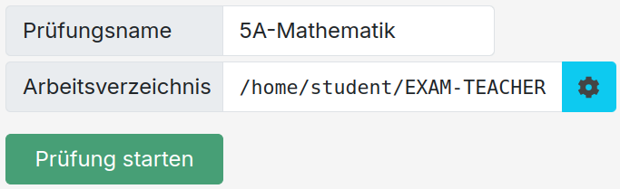 

#### **1.2. Einführung in das Dashboard von Next-Exam**
    Das Teacher-Dashboard bietet eine Übersicht über alle verbundenen Schüler:innen, stellt alle prüfungsrelevanten Informationen übersichtlich dar und ermöglicht es auf einfache Weise die Prüfung einzustellen und einzelne Schüler:innen zu verwalten.

Benutzeroberfläche (wichtige Schaltflächen und Funktionen) 
Erklärung der Sektionen: Prüfungsmodi, Materialien, Schülerverwaltung, Prüfungsordner  
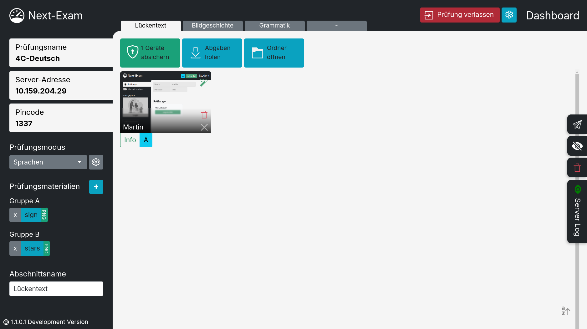

#### **1.2 Prüfungsmodi**
    Next-Exam ermöglicht viele verschiedene Prüfungsvarianten.
    Verfügbare Prüfungsmodi sind: Sprachen, Mathematik, Eduvidual, Webseite, Forms, Office365
    Der Prüfungsmodus kann durch ein "DropDown Menü" gesetzt und direkt konfiguriert werden.

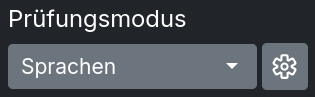 

  - Prüfungsmodus auswählen und konfigurieren

    - Sprachen 

      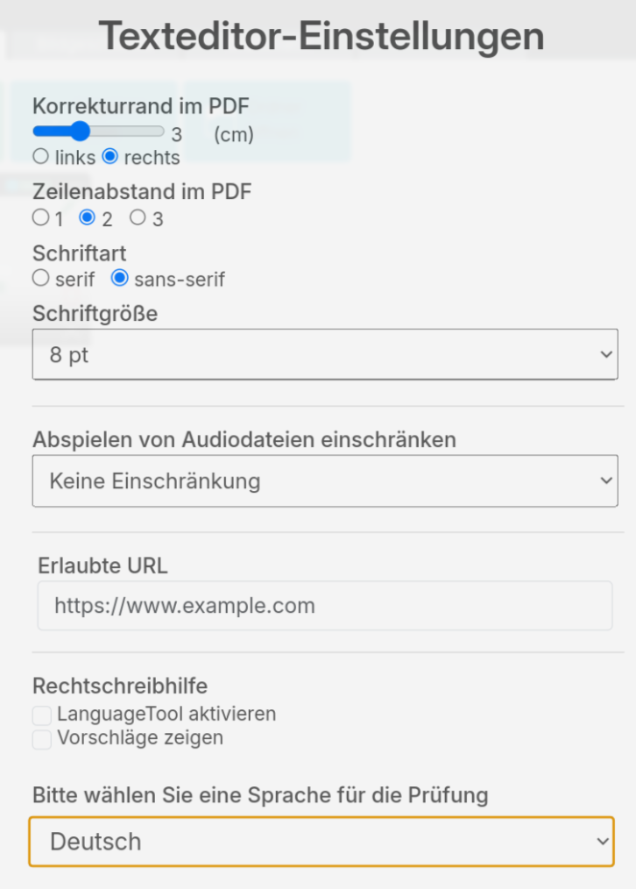 
      Die Einstellungen Korrekturrand, Schriftart, Zeilenabstand und Schrifgröße beziehen sich nicht nur auf die Darstellung
      im Editor sondern auch auf die Erstellung des Abgabe PDF. 
      Das Abspielen von Audiodateien (Die Anzahl der erlaubten Abspielversuche) auf Schüler:innenseite kann eingeschränkt werden. 
      Zusätzliche Hilfsmittel in Form einer Webseite können definiert werden. (z.B. Wörtherbuch) 
      Eine passive Rechtschreibhilfe durch das "LanguageTool" kann aktiviert und konfiguriert werden.
    
    - Mathematik 
    In diesem Prüfungsmodus arbeiten die Schüler:innen mit GeoGebra Classic/Suite

      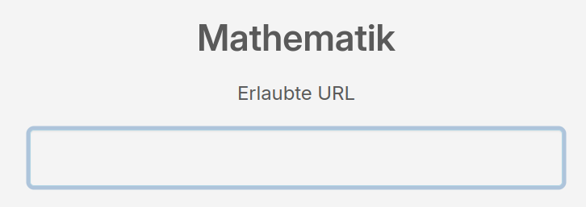 
      Zusätzliche Hilfsmittel in Form einer Webseite (z.B. Formelsammlung) können definiert werden.
  
    - Eduvidual/Moodle  
    Next-Exam übernimmt die Absicherung des Moodle Tests. Es müssen in der Lernplattform keinerlei Einstellungen für das Zusammenspiel mit der Prüfungsumgebung vorgenommen werden.

      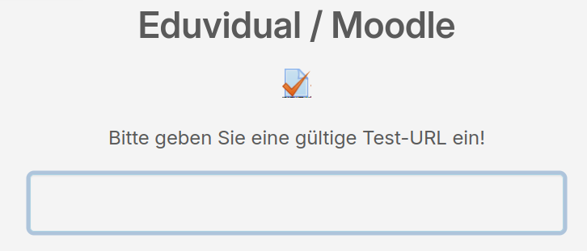 

    - Webseiten

      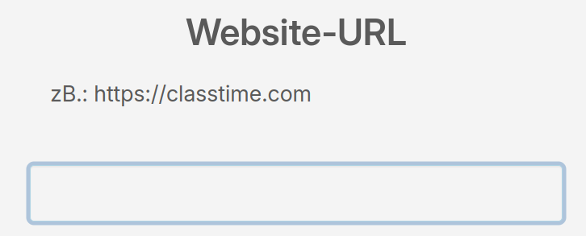 

    - Google Forms

      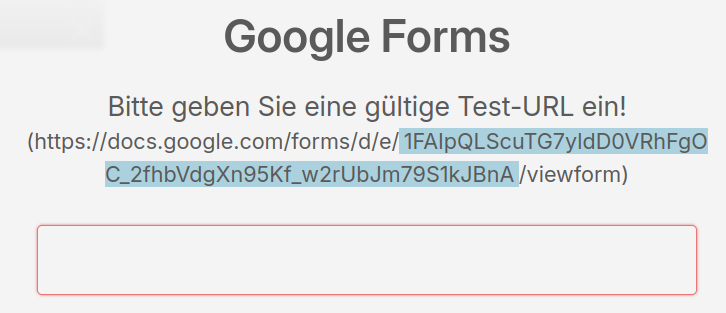 

    - Microsoft365 
    Ein .docx bzw. .xlsx Template muss über Next-Exam bereitgestellt werden. Dieser Modus erstellt aus dem Template automatisch Kopien für jede:n Schüler:in auf dem Onedrive der Lehrperson und generiert "Share-Links" für die Bearbeitung der Dokumente für die verbundenen Schüler:innen.

#### **1.3. Materialien definieren**

- **Materialien bereitstellen:**
  - Auswahl der zugänglichen Materialien (Textdokumente, PDFs, Formelsammlungen, Wörterbücher, Audiodateien, Bilder)
  
    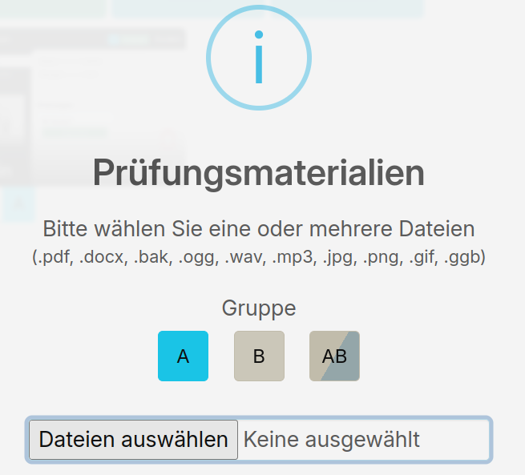 

  - Gruppen- und Einzelschüler-Zuweisung

    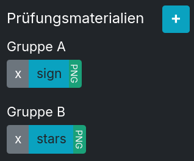 
    Die für die Prüfung notwendigen Materialien werden den Clients in Base64 Form zur Verfügung gestellt und nicht auf den Clients gespeichert.

- **Dateien bereitstellen:**
  - Allen Schüler:innen oder einzelnen Schüler:innen Dateien auch während der Prüfung bereitstellen (Nachteilsausgleich, Zwischenstände, etc.)
  
    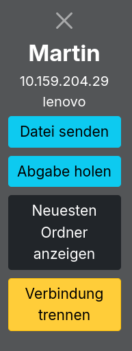 &nbsp;
    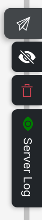 &nbsp;
    
     
    Das Next-Exam System sieht für diesen Zweck mehrere Möglichkeiten vor die dem Anlass entsprechend sinnvoll gewählt werden können.
    Die Sidebar im Dashboard ermöglicht es Dateien im Original an alle Schüler:innen zu senden.  
  

  
  - Sicherungen zurücksenden

    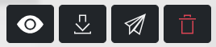 
    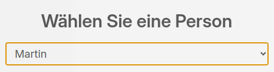

    Der Dateimanager erlaubt es die spezifische Datei direkt auszuwählen und an einzelne Schüler:innen zu senden. Diese Funktion bietet sich an 
    um .bak Dateien (Sicherungsdateien des Editors) zur Weiterbearbeitung nach Unterbrechung den Schüler:innen zukommen zu lassen.
    
    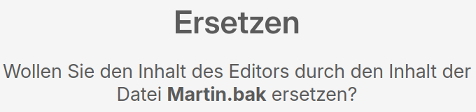
      

  - Studentview  
    Das "Studentview" erlaubt die individuelle Handhabung einzelner Schüler:innen und ebenso das Verteilen von Dateien.
    
     &nbsp;

#### **1.5 Sprache der Benutzeroberfläche wählen**
  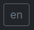 &nbsp;

#### **1.6 Informationskanal vom Bildungsportal abrufen**
  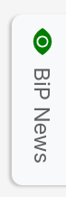 &nbsp;

#### **1.7 Lokal gesicherte Prüfungen löschen bzw. fortsetzen**
    Next-Exam sichert jede Prüfung im Arbeitsordner "EXAM-TEACHER" und speichert in diesem alle Arbeiten der Schüler:innen sowie die Exam-Konfiguration.
  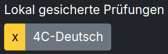 &nbsp;
   
  Durch Klick auf das "x" Symbol kann die lokale Sicherung der Prüfung entfernt werden. Ein Klick auf den Namen aktiviert die gesicherte Prüfung und ermöglicht es diese fortzusetzen.

   
    

#### **1.4. Prüfung starten aus Sicht der Schüler:innen**
    In der Schülerversion von Next-Exam werden im Netzwerk gefundene Prüfungen automatisch angezeigt und können mit einem frei wählbaren Benutzernamen und dem notwendigen PIN-Code betreten werden.

- **Verbindung mit dem Prüfungsserver herstellen:**

     

  - Verbindung via Multicast automatisch oder manuell per IP-Adresse
  - PIN-Code für die Verbindung
- **Gruppen verwalten:**
  - Aktivieren, Gruppenzugehörigkeit ändern, Gruppenspezifische Materialien
- **Geräte absichern:**
  - Absicherung der Geräte und Prüfung starten
- **Bildschirm abdunkeln**
  - Bildschirm abdunkeln um Aufmerksamkeit zu lenken
- **Prüfung beenden:**
  - Abgaben kontrollieren, zusammenfassen
  - Abschluss der Prüfung und Ergebnisse einsehen
  - Geräte entsperren
  - Einzelne Schüler:innen freischalten oder entfernen

#### **1.5. Abgaben einsehen und sichern**
    Der Dateimanager von Next-Exam ermöglicht es den Lehrpersonen alle Abgaben und archivierte Zwischenstände einzusehen und zu verwalten.

  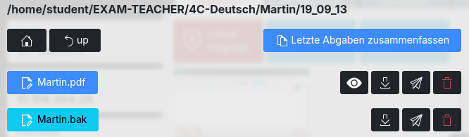 

- **Prüfungsabgaben verwalten:**
  - Fortschritt der Schüler verfolgen
  - Abgaben einsehen, sichern und herunterladen
  - Automatische Archivierung mit Timestamp
  - Automatische Zusammenfassung aller neuesten Abgaben als PDF mit Index (Name, Abgabezeitpunkt, Zeichenanzahl)
- **Abgabe**
  - Finale Abgabe mit Nummerierung
  - Dokumente direkt an den Teacher senden
  - Automatische Archivierung im Ordner "ABGABE"
- **Direktdruck:**
  - Schüler:innen können ihre Arbeit direkt drucken
  - Standarddrucker wählen

---

### **Teil 2: Erweiterte Funktionen**

#### **2.1. Schüler individuell fokussieren**
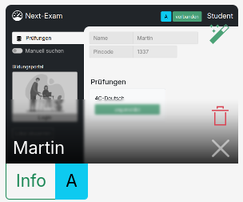

- **Einzelne Schüler überwachen:**
  - Schüler:innen freischalten oder entfernen
  - Prüfung für einzelne Schüler pausieren
  - Daten an einzelne Schüler:innen senden
  - Abgaben einzelner Schüler:innen verwalten
    
    

#### **2.3. Prüfungsabschnitte**
    Für Sprachschularbeiten oder Tests mit mehreren, von einander getrennt zu behandelnden 
    Bereichen können Prüfungsabschnitte aktiviert und unabhängig voneinander Eingestellt werden.

  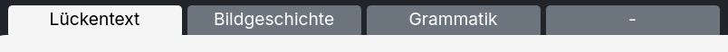

- Prüfungen in Abschnitte unterteilen
- Unterschiedliche Bedingungen für Abschnitte festlegen

#### **2.4. Erweiterte Sicherheitsfunktionen**
   
  &nbsp;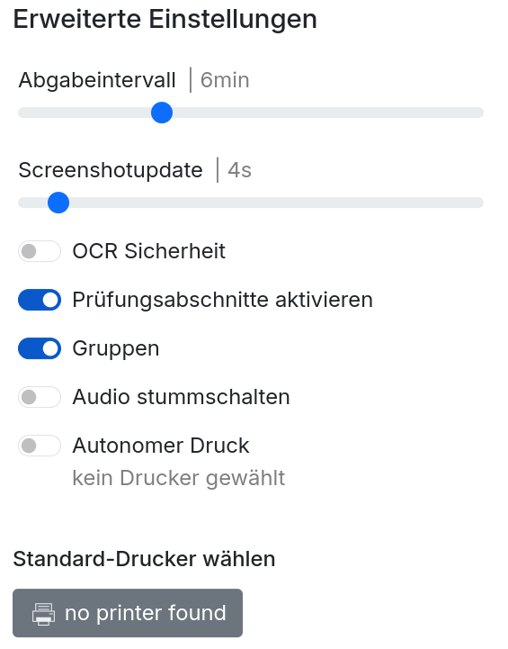

- **Automatisches Abgabeintervall einstellen** Zusätzlich zur manuellen Abgabe die automatische Archivierung der Arbeiten einstellen
- **Screenshot-Intervall einstellen** Zeitintervall für Screenshot Aktualisierung
- **OCR Sicherheit:** Erweiterte Erkennung von Versuchen, die Prüfungsumgebung zu umgehen
- **Prüfungsabschnitte aktivieren:** Unterteilung in mehrere unabhängige Prüfungsabschnitte aktivieren
- **Gruppen:** Die Gruppen A/B sichtbar machen und Zuweisung unterschiedlicher Materialien ermöglichen
- **Audio stummschalten:** Systemsounds (Warnungen, etc.) deaktivieren
- **Autonomer Druck** Schüler:innen Zugriff auf installierten Drucker am Prüfungsserver gewähren

- **Automatische Bereinigung alter Arbeitsdateien in Schülerordnern** Beim Beenden der Prüfung die Arbeitsordner auf Schüler:innenseite löschen

#### **2.5. Integration ins Bildungsportal**
    Über das kommende Bildungsportal Plugin können Prüfungen im Vorfeld konfiguriert, Materialien festgelegt und Listen aller Teilnehmer:innen definiert werden.

- Anbindung an das zentrale Bildungsportal

  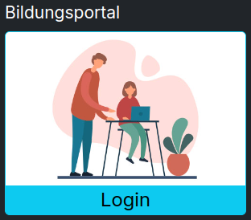
     
  
- Vorkonfigurierte BiP Prüfungen

  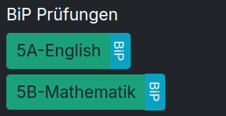

---

## **Teil 3: Fehlerbehandlung**

#### **3.1. Fehlerbehandlung**

- Fehlermeldungen beim Verbindungsaufbau und deren Ursachen
- Problembehandlungsschritte
- Fortsetzen der Prüfung bei Fehler auf Schülerseite
- Fortsetzen der Prüfung bei Fehler auf Teacherseite