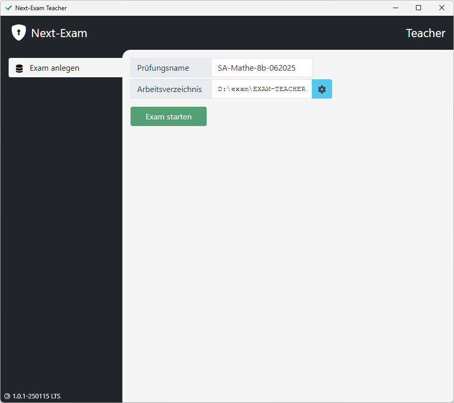
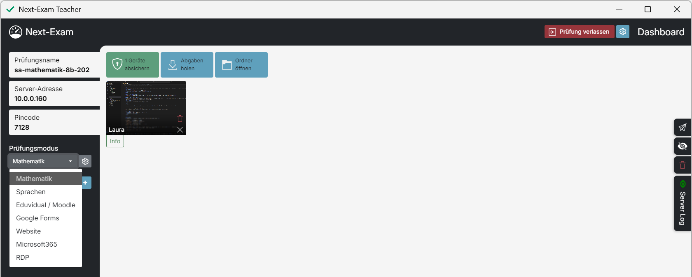

# Teacher - Grundlegende Funktionen

## Prüfungen anlegen
> Der `Prüfungsname` kann frei gewählt werden. Der Arbeitsordner am Desktop beinhaltet alle archivierten Arbeiten und Abgaben sowie die Prüfungsordner und die Prüfungs-Konfiguration.
<figure markdown="span">
    {width="50%"}
    <figcaption>Prüfung anlegen, Prüfungsserver starten</figcaption>
</figure>

### Passwort festlegen (optional)
> Ein `Passwort` kann festgelegt werden um zu verhindern, dass die Prüfung bei Verbindungsverlust vom Student verlassen werden kann.

### Backup-Ordner festlegen (optional)
> Das zusätzliche `Backupverzeichnis` kann individuell gewählt werden (z.B. Netzwerk-Ordner, USB Stick, ...). Hier werden die Prüfungsdaten (Arbeiten der Schüler:innen, Konfiguration, ...) zusätzlich zum oben genannten Arbeitsordner abgelegt.
<figure markdown="span">
    {width="50%"}
    <figcaption>Passwort, Backupverzeichnis</figcaption>
</figure>

## Dashboard
> Das Teacher-Dashboard bietet eine Übersicht über alle verbundenen Schüler:innen und stellt alle prüfungsrelevanten Informationen dar.
Es ermöglicht die Konfiguration der Prüfung und die Verwaltung der Schüler:innen.

<figure markdown="span">
    {width="50%"}
    <figcaption>Dashboard</figcaption>
</figure>

Der automatisch generierte `Pincode` wird von den Schüler:innen benötigt, um der Prüfung beizutreten.
Sollte die Prüfung bei den Schüler:innen nicht aufscheinen, können sie die Prüfung durch Eingabe der `Server-Adresse` finden.

## Prüfungsmodi
> Next-Exam ermöglicht viele verschiedene Prüfungsvarianten. 

<figure markdown="span">
    {width="50%"}
    <figcaption>Prüfungsmodi</figcaption>
</figure>

Verfügbare Prüfungsmodi sind:

- `Mathematik` - ... mit GeoGebra-Integration
- `Sprachen` - Texteditor mit erweiterten Features
- `Eduvidual/Moodle` - LMS-Test im Kiosk-Mode
- `Google Forms` - Formular im Kiosk-Mode
- `Microsoft 365` - online-Versionen von Word, Excel usw.
- `Website` - Website im Kiosk-Mode

> Der Prüfungsmodus kann im Dropdown-Feld `Prüfungsmodus` gewählt werden. Je nach Prüfungsmodus erscheint ein Konfigurationsfenster. Im Nachhinein kann die Prüfungskonfiguration jederzeit über das Zahnrad-Symbol (oben rechts) geöffnet werden.

### Sprachen

<figure markdown="span">
    {width="50%"}
    <figcaption>Prüfungsmodus "Sprachen" - Konfiguration</figcaption>
</figure>

> Einstellungen wie Korrekturrand, Schriftart, Zeilenabstand und Schriftgröße betreffen sowohl die Darstellung im Editor als auch die Erstellung des Ablage-PDF. Audiodateien (Anzahl erlaubter Abspielversuche) können eingeschränkt werden. Zusätzliche Hilfsmittel in Form von Webseiten (z.B. Wörtherbuch) lassen sich definieren. Eine passive Rechtschreibhilfe über "LanguageTool" kann aktiviert und konfiguriert werden.

### Mathematik
In diesem Modus arbeiten die Schüler:innen mit GeoGebra Classic/Suite. Zusätzliche Hilfsmittel, wie eine Formelsammlung über eine Webseite, können gesetzt werden.

### Eduvidual/Moodle
Next-Exam übernimmt die Absicherung des Moodle-Tests. Alle nötigen Einstellungen für die Prüfungsumgebung erfolgen über Moodle selbst.

## Prüfungsunterlagen definieren
## Schüler verwalten
## Abgaben einsehen und sichern
## Prüfung beenden
